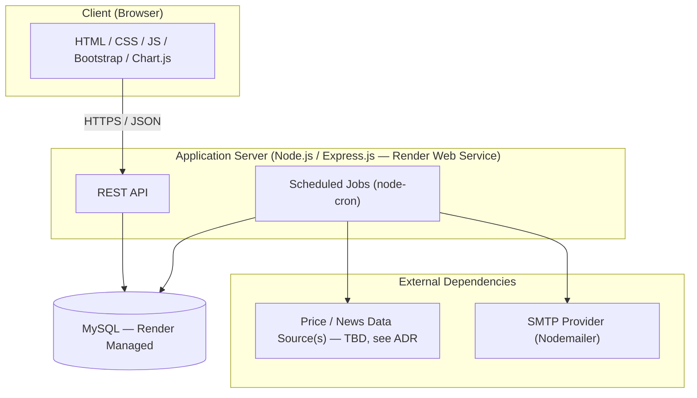
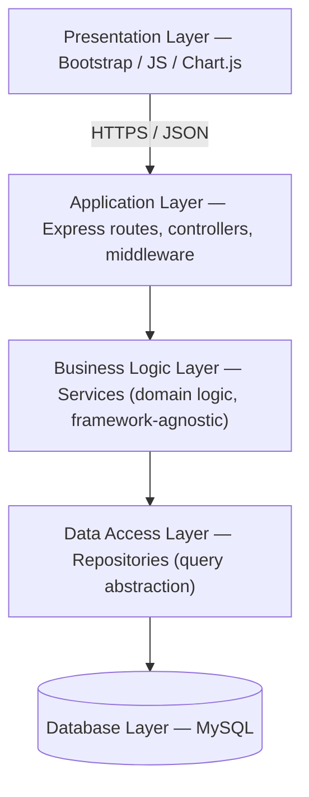
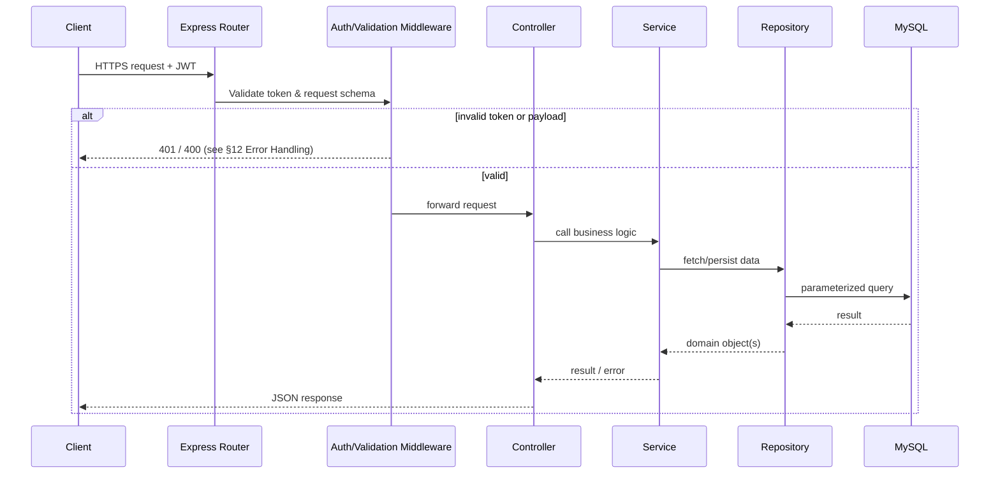
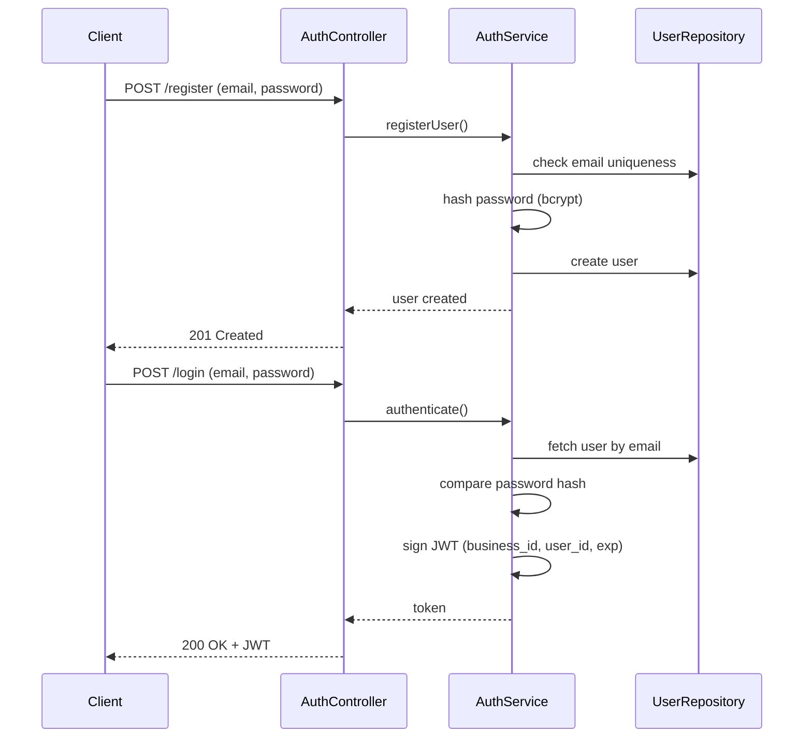
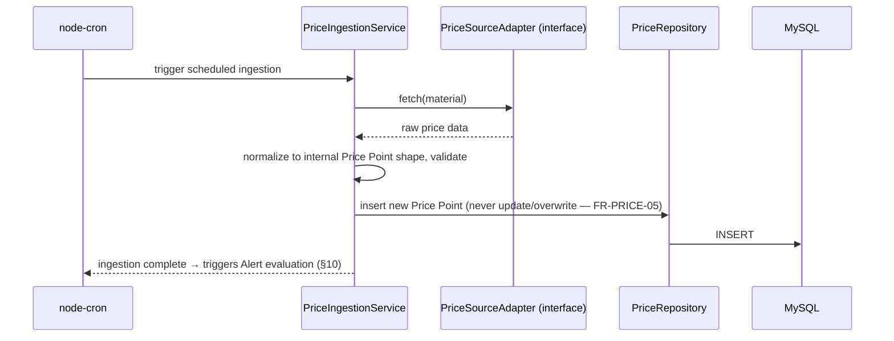
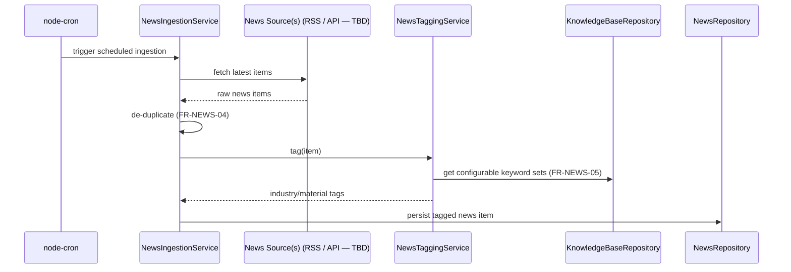
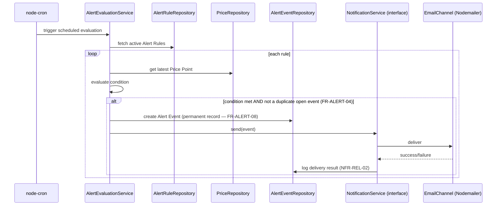
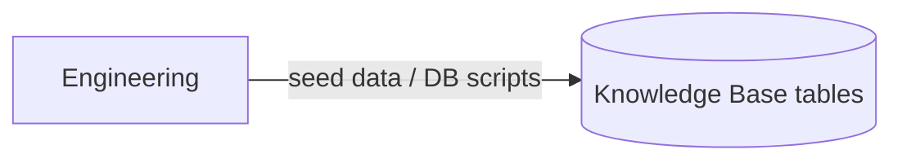
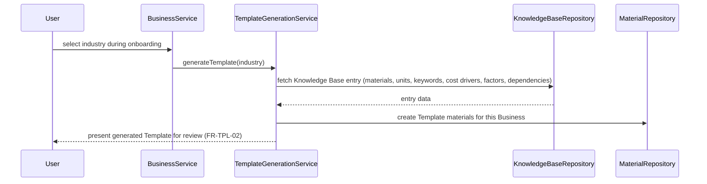
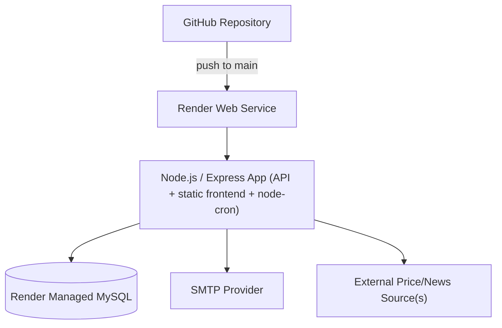

# Document 3: System Architecture

## Document Control

| Field | Value |
|---|---|
| Project Name | Business Market Monitoring & Alert Platform |
| Document | System Architecture |
| Version | 1.1 (Frozen) |
| Status | **Approved — Frozen** |
| Phase | Version 1 (MVP) |
| Baseline Reference | Document 1: Project Vision (v1.2, Frozen), Document 2: SRS (v1.1, Frozen) |
| Prepared By | Engineering (Architect/Lead) |
| Date | 2026-07-18 |
| Approved By | Project Owner, 2026-07-18 |

**Revision note (1.1):** Project confirmed as a budget-constrained student project — Version 1 must be built entirely on free resources (no paid APIs, subscriptions, or commercial data providers). The Price Data Source ADR is updated accordingly: Manual/Admin Entry and free Government/Public Datasets are the only sources in V1 scope; Third-Party APIs, Supplier Integrations, and Web Scraping are explicitly deferred past V1. All other sections and decisions are unchanged. **Document frozen and approved — no further changes without a formal revision.**

**Traceability rule:** every architectural decision here exists to satisfy a requirement from Document 2 (SRS) without violating a scope boundary from Document 1. Where a decision is genuinely open (Price Data Source; multi-level dependency storage), it is explicitly marked as such and deferred to the correct downstream document rather than decided here.

**Format note:** for every major decision below, this document states *why it was chosen*, *at least one alternative*, and *the trade-off* — per your instruction, so this is a design record, not just a design.

---

## 1. Architecture Goals

| Goal | What it means for this system |
|---|---|
| Modularity | Module boundaries mirror the SRS's 10 functional modules exactly — no module's logic leaks into another |
| Scalability | The application layer is stateless and horizontally scalable; growth points (new industries, more materials, more businesses) are data-driven, not code changes (NFR-SC-01, NFR-SC-02) |
| Security | Defense in depth — auth, input validation, and data isolation enforced at multiple layers, not just the UI (NFR-SEC-01–05) |
| Maintainability | Layered separation (Section 3) so logic is written once and reused, and can be tested without a running HTTP server (NFR-MAINT-01, NFR-MAINT-02) |
| Extensibility for V2/V3 | Every seam identified in Document 1 §9 (channel-agnostic alerts, dependency-aware Knowledge Base, single-business-today/multi-business-later data model) is built into this architecture, not deferred as "we'll refactor later" |
| Production-readiness on a lean stack | The approved stack (Render + managed MySQL) must run a real, secure, production system — not a prototype — without requiring infrastructure the MVP can't justify yet |
| Testability | Business logic is isolated from framework/transport concerns so it can be unit tested directly |

---

## 2. High-Level System Architecture

**Architectural style decision: Modular Monolith vs. Microservices**

- **Chosen: Modular Monolith.** A single deployable Node.js/Express application, internally organized into independent modules with strict boundaries that mirror the SRS's 10 modules.
- **Alternative considered: Microservices** — a separate deployable service per module (auth service, price service, alert service, etc.).
- **Trade-off:** Microservices offer independent scaling and deployment per module, but introduce real operational cost — service discovery, inter-service authentication, distributed transactions, multiple deployment pipelines — none of which is justified before V1 has proven user demand. A modular monolith delivers most of the maintainability benefit (low coupling, clear ownership boundaries) at a fraction of the operational cost, and — critically — if module boundaries are drawn correctly now, they become the natural seams for extracting microservices later, rather than requiring a redesign. **Recommended for V1.**

---

## 3. Layered Architecture

| Layer | Responsibility | Must NOT do |
|---|---|---|
| **Presentation** | Render UI, call REST endpoints, render Chart.js visualizations, handle client-side form validation (UX only) | Contain business rules (e.g., alert threshold logic) |
| **Application** | Route requests, authenticate (JWT middleware), validate request shape/schema, call the appropriate service, format the HTTP response | Contain business logic or direct DB queries — controllers stay thin |
| **Business Logic** | Domain rules: template generation, alert evaluation, news tagging, price validation — the actual "what the system does" | Know about HTTP (no `req`/`res`), or write raw SQL |
| **Data Access** | Abstract all MySQL queries behind repository methods (e.g., `MaterialRepository.findTracked(businessId)`) | Contain business rules — a repository fetches/persists, it doesn't decide |
| **Database** | Durable storage, constraints, indexing (schema in Document 4) | — |

**Decision: explicit Repository layer vs. services querying an ORM directly**

- **Chosen:** A thin Repository layer between Business Logic and the database.
- **Alternative:** Skip the abstraction — let services call an ORM (e.g., Sequelize models) directly. Less boilerplate, faster to write initially.
- **Trade-off:** Without a repository boundary, business logic becomes coupled to specific ORM/query syntax, which makes unit testing services harder (you end up needing a real or heavily mocked database to test alert-evaluation logic, for example) and makes a future data-layer change (or read-replica routing, or caching) a cross-cutting rewrite instead of a change in one layer. The repository pattern costs a modest amount of extra boilerplate now, in direct service of NFR-MAINT-01/02. **Recommended.**
- **Deferred, not decided here:** whether the Data Access Layer uses raw `mysql2`, a query builder (e.g., Knex), or an ORM (e.g., Sequelize/Prisma) is an implementation detail that belongs in Document 4 (Database Design), once the schema — including the multi-level dependency structure (FR-IKB-05) — is finalized, since that decision affects which tool handles it best.

---

## 4. Module Breakdown

| # | Module | Core Responsibility | SRS Reference |
|---|---|---|---|
| 1 | Authentication | Registration, login, JWT issuance, password reset | §5.1 |
| 2 | Business Profile | Business creation/edit, industry assignment | §5.2 |
| 3 | Industry Knowledge Base | Reference data: materials, keywords, units, cost drivers, external factors, dependencies | §5.3 |
| 4 | Industry Templates | Auto-generates a Business's starting material set from the Knowledge Base | §5.4 |
| 5 | Raw Material Tracking | Business's chosen subset of materials to monitor, plus custom materials | §5.5 |
| 6 | Price Tracking | Time-series price ingestion and retrieval | §5.6 |
| 7 | News Monitoring | Ingest, tag, and surface relevant news | §5.7 |
| 8 | Alerts | Rule definition, evaluation, notification delivery, history | §5.8 |
| 9 | Dashboard | Aggregated read view across modules 5–8 | §5.9 |
| 10 | Historical Trends | Charting over Price Tracking data | §5.10 |

Each module owns its own Controller(s), Service(s), and Repository(ies) — no shared "god" service. Cross-module reads (e.g., Dashboard reading Price + News + Alerts) happen by one module's service calling another module's service interface, never by reaching directly into another module's repository or tables.

---

## 5. Component Responsibilities

| Module | Controller | Service | Repository |
|---|---|---|---|
| Authentication | `AuthController` | `AuthService` (hashing, JWT issuance, reset-token logic) | `UserRepository` |
| Business Profile | `BusinessController` | `BusinessService` | `BusinessRepository` |
| Knowledge Base | `KnowledgeBaseController` *(read-only in V1, no write endpoints — see §11)* | `KnowledgeBaseService` | `KnowledgeBaseRepository` |
| Templates | *(no dedicated controller — invoked internally during onboarding)* | `TemplateGenerationService` | *(reads via `KnowledgeBaseRepository`, writes via `MaterialRepository`)* |
| Raw Material Tracking | `MaterialController` | `MaterialTrackingService` | `MaterialRepository` |
| Price Tracking | `PriceController` | `PriceIngestionService`, `PriceQueryService` | `PriceRepository` |
| News Monitoring | `NewsController` | `NewsIngestionService`, `NewsTaggingService` | `NewsRepository` |
| Alerts | `AlertController` | `AlertEvaluationService`, `NotificationService` | `AlertRuleRepository`, `AlertEventRepository` |
| Dashboard | `DashboardController` | `DashboardAggregationService` *(composes other modules' services)* | *(none directly — reads via other repositories)* |
| Historical Trends | `TrendController` | `TrendQueryService` | *(reuses `PriceRepository`)* |

This table is the direct blueprint for Section 7 (Implementation) folder structure once we get there — naming this now avoids inconsistent naming later.

---

## 6. Request Flow (generic synchronous API request)

Every request that touches Business-owned data is scoped by `business_id` derived from the JWT — never from a client-supplied parameter — enforced at the Repository layer (see §13, Security Architecture).

---

## 7. Authentication Flow

**Decision: JWT (stateless) vs. server-side sessions**

- **Chosen: JWT**, issued at login, sent as a Bearer token on subsequent requests.
- **Alternative: server-side sessions** (`express-session` backed by a MySQL or Redis session store).
- **Trade-off:** Sessions allow instant server-side revocation (logout immediately invalidates access) with less plumbing. JWTs are stateless — any app instance can validate a token without shared session storage, which directly supports horizontal scaling (NFR-SC-01) and avoids introducing a Redis dependency this stack doesn't otherwise need. The cost is that JWTs can't be revoked instantly by default. **Recommended mitigation:** short-lived access tokens plus a refresh-token flow (or, at minimum, a conservative expiry with re-login required), so the revocation gap is bounded rather than open-ended. This is a concrete recommendation for Document 5 (API Design) to formalize, not an open question.

**Password Reset (FR-AUTH-07, mandatory):** emailed single-use, time-limited reset token (via Nodemailer) — standard token-based reset flow, detailed further in Document 5.

**Email Verification (FR-AUTH-08, optional/non-blocking):** if implemented, follows the same token-email pattern but must not gate registration or login — a user can use the platform unverified; verification status is informational only in V1.

---

## 8. Market Price Data Flow

**Decision: Adapter Pattern for price sourcing**

- **Chosen:** A `PriceSourceAdapter` interface that `PriceIngestionService` depends on, with concrete implementations (`ManualEntryAdapter`, `GovernmentDatasetAdapter`, `ThirdPartyApiAdapter`, etc.) plugged in per material or industry.
- **Alternative:** Hard-code the ingestion logic to call one specific source directly inside the service.
- **Trade-off:** Hard-coding is simpler today, but it locks in a source-selection decision at the architecture level — which contradicts the explicit instruction to keep that decision open (see the ADR below), and it forecloses the realistic possibility that different materials need different sources (e.g., government data for agri-linked Dairy inputs, manual entry for PET resin, a paid API later for crude oil). The adapter pattern costs one interface and is what makes deferring the ADR decision architecturally *safe* rather than just postponed. **Recommended.**

*(See the dedicated Architecture Decision Record at the end of this document for the sourcing comparison itself.)*

---

## 9. News Ingestion Flow

**Decision: keyword matching vs. ML-based relevance tagging**

- **Chosen:** Deterministic keyword/substring matching against the Knowledge Base's configurable keyword sets (FR-NEWS-05).
- **Alternative:** ML/NLP-based classification of article relevance.
- **Trade-off:** ML tagging handles ambiguous phrasing better, but requires training data, model hosting, and ongoing tuning — and it *is*, by definition, the kind of AI capability Document 1 explicitly defers to V2. Keyword matching is deterministic, explainable to the user ("why am I seeing this article?"), and cheap to run in a cron job. `NewsTaggingService` is written as its own component specifically so it can be swapped for an ML-based strategy later without touching the ingestion pipeline around it. **Recommended for V1.**

---

## 10. Alert Processing Flow

**Decision: `NotificationService` channel abstraction (Strategy pattern)**

- **Chosen:** `NotificationService` depends on a `NotificationChannel` interface; `EmailChannel` (Nodemailer) is the only implementation in V1.
- **Alternative:** Call Nodemailer directly from `AlertEvaluationService`.
- **Trade-off:** Direct calling is less code today, but it directly contradicts FR-ALERT-07 and Document 1 §9's explicit channel-agnostic commitment — adding WhatsApp in V2 would mean modifying evaluation logic itself, not just adding a channel. The abstraction is a small, deliberate cost paid now for a guarantee already promised to you in Document 1. **Recommended, not optional.**

---

## 11. Industry Knowledge Base Flow

Unlike the flows above, this isn't a single request/response or scheduled cycle — it has two distinct paths:

**A. Maintenance path (how the Knowledge Base gets populated/updated) — per OI-1, resolved in Document 2:**

No admin UI in V1 (FR-IKB-04 satisfied via seed scripts, not a built tool) — deliberately, to avoid unjustified MVP complexity.

**B. Consumption path (how a Business's onboarding uses it):**

The Knowledge Base is also read by `NewsTaggingService` (§9, keyword sets) and referenced by `PriceIngestionService` adapters (§8, material/unit identifiers) — it is genuinely shared reference data, not owned by any single module.

**Explicitly deferred here, per your instruction:** *how* multi-level dependency chains (FR-IKB-05) are physically stored — recursive self-referencing tables, a closure table, or another structure — is **not decided in this document**. It is identified here only as a required capability of the Knowledge Base Repository; the storage mechanism is a Document 4 (Database Design) decision, to be made after evaluating the schema as a whole.

---

## 12. Error Handling Strategy

- **Centralized error handling:** controllers never format error responses inline — they call `next(err)`, and a single Express error-handling middleware produces consistent JSON error responses. This avoids inconsistent error shapes across 10 modules.
- **Error taxonomy** (custom `AppError` hierarchy, each carrying an HTTP status and a safe user-facing message, separate from internal detail):

| Error Type | HTTP Status | Example |
|---|---|---|
| ValidationError | 400 | Malformed request body |
| AuthenticationError | 401 | Missing/invalid JWT |
| AuthorizationError | 403 | Valid user, wrong business's data |
| NotFoundError | 404 | Material/rule doesn't exist |
| ConflictError | 409 | Duplicate email at registration |
| InternalError | 500 | Unexpected failure — logged in full server-side, generic message to client |

- **Never leak internals:** stack traces and raw DB error messages are logged server-side only, never returned to the client (supports NFR-SEC).
- **Scheduled job errors:** each node-cron job wraps its execution in try/catch independently — a failure in News Ingestion must not crash Price Ingestion or Alert Evaluation (NFR-REL-01). Failures are logged; jobs are not retried in a tight loop, only on their next scheduled run, to avoid hammering a failing external source.
- **Process-level crash-and-restart** (Render's supervisor restarting the app on an unhandled exception) is a last-resort safety net, not the primary error-handling mechanism — if this is happening regularly, it means the centralized handling has a gap, not that the system is working as designed.

---

## 13. Security Architecture

| Control | Implementation |
|---|---|
| Password storage | bcrypt (or equivalent adaptive hash) — NFR-SEC-01 |
| Authentication | JWT bearer tokens, short-lived + refresh flow (§7) — NFR-SEC-02 |
| Data isolation | Every repository method scopes queries by `business_id` from the verified JWT, never a client-supplied ID — enforced at the Data Access Layer, not just checked in controllers (defense in depth) — NFR-SEC-03 |
| Input validation | Schema validation middleware at the Application Layer, before any request reaches a service — NFR-SEC-04 |
| SQL injection prevention | Parameterized queries only; no string-concatenated SQL permitted anywhere in the Data Access Layer — NFR-SEC-04 |
| Transport security | HTTPS enforced end-to-end (Render provides TLS termination); HSTS header recommended |
| Secrets management | DB credentials, JWT signing secret, SMTP credentials — environment variables only, never committed to source control — NFR-SEC-05 |
| Brute-force mitigation | *(New recommendation, not in SRS but standard production practice)*: rate limiting on `/login` and `/register` endpoints |
| Cross-origin policy | CORS restricted to the deployed frontend origin(s) only |
| Dependency hygiene | Routine `npm audit` / dependency scanning as part of the development workflow, not a one-time setup step |

> **Flagging the rate-limiting addition:** this wasn't an explicit SRS requirement, but brute-force protection on auth endpoints is a baseline expectation for anything calling itself production-ready. Including it here as a recommended security control now so it's built in from the start rather than retrofitted after an incident.

---

## 14. Scalability Considerations

- **Stateless application layer:** JWT auth (no in-memory session state) means any number of app instances can serve requests interchangeably — supports NFR-SC-01.
- **Knowledge Base growth is data-driven:** adding a new industry (beyond the 5 approved) requires new seed data only, no code change — NFR-SC-02.
- **Scheduled jobs are the one real constraint on horizontal scaling in V1:** node-cron jobs run in-process (§15). If the app is ever scaled to multiple instances, running the same cron schedule on every instance would cause duplicate ingestion runs and — more seriously — duplicate alert emails. **V1 accepts this constraint explicitly** rather than solving it prematurely: the job-triggering logic is isolated in its own module specifically so it can be extracted into a single dedicated worker later (NFR-SC-03) without rewriting the jobs themselves.
- **Database growth:** Price Points, News Items, and Alert Events are the fastest-growing tables. Indexing strategy is finalized in Document 4, but this document commits to connection pooling at the Data Access Layer as a baseline.
- **Future caching:** dashboard reads could benefit from a cache layer at higher scale — explicitly not needed at V1's expected load, noted as a future extension (§16), not built now.

---

## 15. Deployment Architecture

- **Single Render Web Service** hosts the Express API, serves the static Bootstrap/JS frontend, and runs node-cron jobs in-process — one deployable unit for V1.
- **Render Managed MySQL** for the production database — managed backups/patching, no self-hosted DB operations burden.
- **Environment-based configuration** (development/staging/production) entirely via environment variables — no environment-specific code branches.
- **CI/CD:** GitHub → Render auto-deploy on push to the protected main branch. No multi-stage pipeline yet — appropriate for a single-team MVP, revisit as the team grows.

**Decision: Express-served frontend vs. separate Vercel deployment**

- **Chosen:** Serve the static frontend from the same Express app as the API.
- **Alternative:** Deploy the frontend separately on Vercel (listed as an option in the approved stack), with the Express app as a pure API.
- **Trade-off:** A separate frontend deployment enables CDN-level performance and independent frontend scaling, but introduces CORS configuration and two deployment pipelines to coordinate — overhead not justified for a single-team MVP. **Recommended: single Express-served deployment for V1**; revisit a Vercel split if frontend complexity or traffic genuinely grows in V2/V3.

---

## 16. Future Extension Points

Every one of these is a seam this architecture deliberately builds in now, without implementing the V2/V3 feature itself:

| Seam | Enables (V2/V3) | Built in V1 as |
|---|---|---|
| `PriceSourceAdapter` interface | Adding/switching price sources, including AI-assisted source selection | Adapter Pattern (§8) |
| `NotificationChannel` interface | WhatsApp and other alert channels | Strategy Pattern (§10) |
| Knowledge Base dependency relationships | AI Impact Analysis, recommendations | Structured relationship data (FR-IKB-05; storage mechanism in Document 4) |
| `NewsTaggingService` as its own component | ML/NLP-based relevance tagging | Swappable strategy (§9) |
| Business entity design | Multi-business / multi-user (V3 Enterprise) | Single-business-per-user today, structured to extend via relationships, not restructuring (Document 1 §9) |
| Modular monolith boundaries | Extracting microservices if/when scale demands it | Module boundaries already drawn at service-interface level (§4) |
| Isolated job-triggering module | Dedicated worker service for scheduled jobs | Job logic separated from HTTP-serving logic now (§14) |

---

## Architecture Decision Record (ADR): Price Data Source Strategy

**Status: Approved for V1, with the source category now locked in — exact per-material dataset/endpoint mapping confirmed at implementation start (Documents 4/5).**

**Project constraint (confirmed):** this is a budget-constrained student project. **Version 1 must be fully implementable using free resources only — no paid APIs, enterprise subscriptions, or commercial data providers.** This constraint governs the comparison and recommendation below and overrides cost/benefit reasoning that would otherwise favor a paid option.

To ground this comparison in reality rather than generic trade-off language, I researched what actually exists for the industries this platform targets (Packaged Drinking Water as anchor, plus Plastic Manufacturing, Food & Beverage, Dairy).

| Option | Cost | Reliability | Scalability | Maintenance | Legal | Suitability for V1 |
|---|---|---|---|---|---|---|
| **Manual / Admin Data Entry** | **Free** (labor/time only) | High per-entry accuracy if disciplined; depends entirely on consistency | Poor — doesn't scale with materials/businesses without proportional labor | Low technical maintenance, ongoing operational effort | None | **Default for V1** for any material with no reliable free public source — explicitly including PET Resin, Bottle Caps, Labels, Cartons, and Shrink Film, the anchor industry's core materials |
| **Government / Public Datasets** *(e.g., India's Agmarknet/data.gov.in for agri commodities; PPAC for fuel prices)* | **Free** | High for covered commodities (Agmarknet is officially verified government data); coverage is narrow | Good within its coverage, doesn't extend beyond tracked commodities | Low-to-medium — public-sector APIs vary in documentation/rate-limit maturity | Low — explicitly open government data | **Used in V1 wherever coverage genuinely exists** — fuel/diesel (a shared cost driver across all five industries) and Dairy/Food & Beverage-adjacent agri commodities. Does not cover PET resin, caps, or shrink film — those fall back to Manual Entry |
| **Third-Party APIs** *(general commodity APIs; specialty providers like ICIS/ChemAnalyst for plastics)* | Ranges from affordable (~$0–250/month tiers) to enterprise/quote-based subscriptions | High | High | Low (vendor-maintained) | Low if licensed properly | **Excluded from V1 by the free-resources constraint**, even the affordable tiers — free tiers on these services are typically rate-limited or require a card on file, which isn't a safe assumption for a student-budget build. Deferred to V2+; the `PriceSourceAdapter` interface (§8) is built precisely so this can be added later without touching business logic |
| **Supplier Integrations** | Low platform cost, high relationship/integration cost per supplier | Potentially highest relevance, dependent on supplier cooperation | Poor as a platform-wide V1 strategy | High — bespoke per connector | Generally low, may need data-sharing agreements | **Excluded from V1** — not a budget issue, a scale/complexity one; doesn't fit a single-team MVP regardless of cost. Deferred to V3 |
| **Web Scraping** | Free directly, real ongoing engineering cost | Low — fragile, breaks when source markup changes | Moderate technically, high per-source maintenance | High — reactive | **Highest risk** — may violate a source site's Terms of Service; requires legal review per source | **Not recommended for V1** regardless of budget — the risk is legal, not financial |

### Recommendation for V1 (approved, free-resources-only)

1. **Manual/Admin Data Entry is the default source** for any material without a reliable free public dataset — this explicitly includes the Packaged Drinking Water anchor industry's core materials: PET Resin, Bottle Caps, Labels, Cartons, and Shrink Film.
2. **Government/Public Datasets are used wherever genuine free coverage exists** — fuel/diesel pricing (a shared Operational Cost Driver across all five industries) and Dairy/Food & Beverage-adjacent agricultural commodities via Agmarknet/data.gov.in.
3. **Third-Party APIs, Supplier Integrations, and Web Scraping are explicitly out of scope for V1** — not evaluated further for this phase. The `PriceSourceAdapter` interface (§8) is unchanged and remains the seam that lets any of these be added in V2/V3 without modifying `PriceIngestionService` or any downstream business logic (alert evaluation, dashboards, historical trends all consume Price Points the same way regardless of source).
4. **Exact per-material mapping** (which specific government dataset/endpoint applies to which tracked material, if any) is confirmed at the start of implementation — Documents 4 and 5 — not finalized here.

This keeps Version 1 buildable at zero external cost while preserving the exact same forward-compatible architecture already approved — nothing about the Adapter Pattern, the ingestion flow, or downstream consumers changes because of this constraint. That is precisely what the abstraction was for.

---

## Approval — Frozen

**Status: Approved and frozen (v1.1) by the Project Owner on 2026-07-18.** All architectural decisions — Modular Monolith, Layered Architecture, Repository Pattern, Adapter Pattern, Strategy Pattern, JWT authentication, rate limiting on auth endpoints, single Express deployment for V1, and the Price Data Source ADR (free-resources-only for V1) — are approved as written. Multi-level dependency storage remains explicitly deferred to Document 4, by design.

This document is now, alongside Documents 1 and 2, a baseline reference for all subsequent milestones. Any future change requires a formal revision (new version number + revision note), not a silent edit.

**Next milestone: Document 4 — Database Design.**
