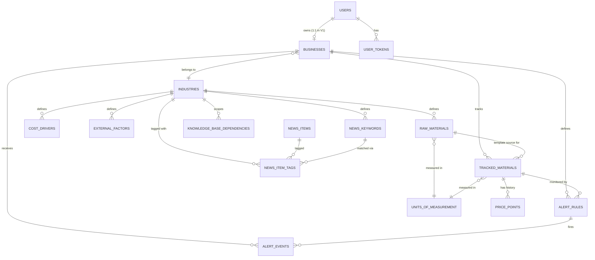

# Document 4: Database Design

## Document Control

| Field | Value |
|---|---|
| Project Name | Business Market Monitoring & Alert Platform |
| Document | Database Design |
| Version | 1.1 (Frozen) |
| Status | **Approved — Frozen** |
| Phase | Version 1 (MVP) |
| Baseline Reference | Document 1 (v1.2), Document 2 (v1.1), Document 3 (v1.1) — all Frozen |
| Prepared By | Engineering (Database Architect) |
| Date | 2026-07-18 |
| Approved By | Project Owner, 2026-07-18 |

**Revision note (1.1):** Resolved the four open items from Section 12.2 — MySQL version target, price history immutability approach, tracked materials uniqueness acceptance, and alert rules soft-delete-only policy. No tables, relationships, indexes, normalization strategy, or architectural decisions were changed. **Document frozen and approved — no further changes without a formal revision.**

**Traceability rule:** every table in this document exists because a specific requirement in Document 2 (SRS) needs it. Where a table's purpose isn't obvious, its "Purpose" line states the requirement ID it serves. No table is included speculatively for V2/V3.

**Methodology note:** this document follows standard database design progression — conceptual (Section 3: what entities exist), logical (Section 4–6: how they relate), then physical (Section 5, 9–10: actual columns, types, indexes, constraints) — rather than jumping straight to `CREATE TABLE` statements.

---

## 1. Database Design Goals

| Goal | What it means for this schema |
|---|---|
| **Scalability** | Growth in tracked materials, price history, and news volume must be handled by indexing and query design, not schema changes. New industries are data (Section 7), not new tables or code. |
| **Maintainability** | Consistent naming, consistent PK/FK strategy, no duplicated logic expressed as duplicated columns — a developer who understands one table's conventions understands all of them. |
| **Data Integrity** | Every relationship that *can* be enforced by the database *is* — FK constraints, CHECK constraints, uniqueness — rather than relying on application code alone. Where MySQL genuinely cannot enforce something (Section 7.2, Section 10), that gap is named explicitly, not silently assumed away. |
| **Performance** | Every index recommendation (Section 9) is tied to a real query pattern from the SRS or Architecture document — not speculative "index everything." |
| **Future Extensibility** | Section 11 shows, table by table, that V2/V3 features (AI reasoning, WhatsApp, multi-business, supplier integrations) are additive to this schema, not a redesign — this was a stated goal since Document 1 §9, and this is where that promise gets kept or broken. |

---

## 2. Database Architecture

### 2.1 Why MySQL

MySQL was already approved as the project's stack (Document 1). For this document specifically, the fit reasoning is:

- The domain is **highly relational** — materials, cost drivers, factors, and their dependencies; users and businesses; time-series price and alert history. A relational database models this far more naturally than a document/NoSQL store would.
- **InnoDB** (MySQL's default engine) gives ACID transactions, row-level locking, and enforced foreign keys — all needed for concurrent price ingestion and alert evaluation (Document 3 §8, §10).
- **MySQL 8.0+ supports recursive CTEs** (`WITH RECURSIVE`), which is the deciding technical capability behind the multi-level dependency chain design in Section 7.
- Broad availability of **free-tier managed hosting** (relevant given the confirmed student-budget constraint) with mature Node.js driver support (`mysql2`).

**Honest trade-off vs. PostgreSQL:** PostgreSQL has some genuinely stronger features for this exact schema — notably **partial/filtered unique indexes**, which would cleanly solve a uniqueness rule this schema needs (Section 5, `tracked_materials`) but MySQL cannot express natively. Since Document 1 already fixed MySQL as the approved stack, this isn't being re-opened — but the gap is real and is called out explicitly where it matters (Section 10) rather than glossed over.

### 2.2 Normalization Strategy

The schema targets **3NF** throughout, relaxed deliberately (and explicitly) in a small number of places for read performance. Concretely:

- **1NF:** every column holds a single atomic value — e.g., `knowledge_base_dependencies` never stores a comma-separated list of dependent materials; each dependency is its own row.
- **2NF:** every non-key column depends on the *whole* primary key — straightforward here since every table uses a single-column surrogate key (Section 2.3), so partial-key dependency issues don't arise.
- **3NF:** no non-key column depends on another non-key column. Example: `raw_materials` stores `industry_id`, not the industry's name — the name lives only in `industries`, reached by join. This is applied consistently across the Knowledge Base tables (Section 7).

**Deliberate, documented denormalization (not accidental redundancy):**
- `alert_events.business_id` — derivable via `alert_rule_id → business_id`, but stored directly to avoid a join on the highest-frequency dashboard read path, and to keep the row meaningful even in an edge case where a rule is removed. Flagged again at point of use (Section 5).
- `knowledge_base_dependencies.industry_id` — derivable via either endpoint, stored directly for the same reason (fast "all dependencies in industry X" queries).

Every other relationship in this schema is fully normalized. Denormalization is used exactly twice, both times for a named, high-frequency query pattern — not as a general pattern.

### 2.3 Naming Conventions

| Convention | Rule | Example |
|---|---|---|
| Table names | plural, `snake_case` | `tracked_materials`, `alert_events` |
| Column names | singular, `snake_case` | `business_id`, `recorded_at` |
| Primary keys | always `id` | — |
| Foreign keys | `<referenced_table_singular>_id` | `raw_material_id`, `business_id` |
| Booleans | prefixed `is_` / `has_` | `is_active`, `is_tracked` |
| Timestamps (auto-managed, "when this row changed") | suffixed `_at`, type `TIMESTAMP` | `created_at`, `updated_at` |
| Timestamps (domain fact, not row-modification) | suffixed `_at`, type `DATETIME` | `recorded_at`, `triggered_at`, `expires_at` |

**Why the `TIMESTAMP` vs. `DATETIME` distinction matters:** `created_at`/`updated_at` describe *when the database row changed* and benefit from `DEFAULT CURRENT_TIMESTAMP` / `ON UPDATE CURRENT_TIMESTAMP` auto-management. `recorded_at` on a Price Point is a *domain fact* (the price is FOR this date — which may be backdated during manual entry) and must never auto-update; using `DATETIME` for these makes that distinction unambiguous at the schema level, not just by convention.

### 2.4 Primary Key Strategy

**Chosen: surrogate auto-increment `BIGINT UNSIGNED` on every table (`id`).**

- **Alternative considered:** UUID primary keys.
- **Trade-off:** UUIDs avoid exposing sequential, guessable IDs and suit distributed/multi-database merging scenarios. But they're larger (16 bytes vs. 8), and random UUID inserts fragment InnoDB's clustered index (causing page splits that hurt write performance) — a real cost for `price_points`, the fastest-growing table in this schema. Given V1 runs a single managed MySQL instance (Document 3 §15) with no cross-database merge requirement, auto-increment `BIGINT UNSIGNED` is simpler, faster to index, and sufficient. **Recommended for V1**; revisit only if a future multi-database/multi-region V3 scenario genuinely requires it.
- **Note for later:** exposing raw sequential IDs in public API URLs is an enumeration-risk concern — flagged here for Document 5 (API Design) to address at that layer (e.g., scoping all lookups to the authenticated `business_id` regardless of the ID guessed), not solved in the schema itself.

### 2.5 Foreign Key Strategy

- Every relationship that maps cleanly to a single target table has a **database-enforced FK constraint** (InnoDB) — not just an application-layer check.
- **Default `ON DELETE` policy is `RESTRICT`** unless a specific relationship has a stated reason to `CASCADE` or `SET NULL` (each such exception is justified individually in Section 10, not left implicit).
- **One documented exception exists:** `knowledge_base_dependencies` (Section 7.2) uses a polymorphic association (a type-discriminator column plus an ID column) to reference three different possible target tables. MySQL cannot express a single FK constraint across conditionally-different tables — this is a genuine limitation of the relational model here, not an oversight, and it is compensated for at the application layer (Section 10).

**Why ENUM columns instead of lookup tables for small fixed sets** (`condition_type`, `notification_channel`, `delivery_status`, `token_type`, `job_type`, `dependency_type`): these represent sets of values where adding a new value *always* requires new application code anyway (e.g., adding a `WHATSAPP` notification channel requires a new `NotificationChannel` implementation per Document 3 §10 — the ENUM migration happens at the same time as that code change, not as extra separate work). This is different from the Knowledge Base tables (Section 7), where new values (a new raw material, a new industry) are meant to be added as pure data, with zero code change — those are lookup/reference tables, not ENUMs, by deliberate design (NFR-SC-02).

---

## 3. Entity Identification

Every entity required by the approved V1 scope (Document 2, Section 5), identified before any table is designed:

| # | Entity | Category | Purpose | Traces to |
|---|---|---|---|---|
| 1 | User | Identity & Access | Registered account, auth root | FR-AUTH-01–06 |
| 2 | User Token | Identity & Access | Password reset / email verification tokens | FR-AUTH-07, FR-AUTH-08 |
| 3 | Business | Core | The single business profile per user in V1 | FR-BIZ-01–04 |
| 4 | Industry | Knowledge Base | One of the 5 approved V1 industries, as data | FR-IKB-01, NFR-SC-02 |
| 5 | Unit of Measurement | Knowledge Base | Shared reference units (kg, litre, etc.) | FR-IKB-01, FR-MAT-04 |
| 6 | Raw Material (KB) | Knowledge Base | Master list of materials per industry | FR-IKB-01, FR-TPL-01 |
| 7 | Cost Driver (KB) | Knowledge Base | Master list of operational cost drivers per industry | FR-IKB-01 |
| 8 | External Factor (KB) | Knowledge Base | Master list of external market factors per industry | FR-IKB-01 |
| 9 | News Keyword (KB) | Knowledge Base | Configurable keyword sets per industry | FR-IKB-01, FR-NEWS-05 |
| 10 | Knowledge Base Dependency | Knowledge Base | Relationships between materials/cost drivers/factors | FR-IKB-02, FR-IKB-05 |
| 11 | Tracked Material | Business Data | A business's actively monitored materials (KB-linked or custom) — also serves as the materialized Industry Template | FR-TPL-01–03, FR-MAT-01–04 |
| 12 | Price Point | Business Data | Immutable time-series price history | FR-PRICE-01–05 |
| 13 | News Item | Shared Data | An ingested news article | FR-NEWS-01, 04 |
| 14 | News Item Tag | Shared Data | Many-to-many link: News Item ↔ Industry | FR-NEWS-02, 03 |
| 15 | Alert Rule | Business Data | User-defined alert condition | FR-ALERT-01, 05 |
| 16 | Alert Event | Business Data | Immutable record of a fired alert | FR-ALERT-03, 04, 08 |
| 17 | Sync Status | System | Last successful ingestion run, per job type | FR-DASH-04 |

No entity here maps to a V2/V3 feature (AI reasoning, WhatsApp, supplier integration, multi-business) — those are addressed in Section 11 as extensions of this list, not additions to it.

---

## 4. ER Diagram

**Not shown above (by necessity, not omission):** `knowledge_base_dependencies` connects `raw_materials`, `cost_drivers`, and `external_factors` to each other polymorphically — a raw material can depend on another raw material, a cost driver, or an external factor, and so can a cost driver or a factor. This can't be drawn as conventional ER lines because it isn't a conventional FK relationship (Section 7.2 explains why, and how). `sync_statuses` also isn't shown — it has no relationships, only global rows.

---

## 5. Table Design

Every table below states its **purpose first** (why it exists, tied to an SRS requirement), then its full column specification.

### 5.1 Identity & Access

#### `users`
**Purpose:** the authentication root entity — every registered account (FR-AUTH-01–06).

| Column | Type | Nullable | Default | Notes |
|---|---|---|---|---|
| id | BIGINT UNSIGNED | No | AUTO_INCREMENT | PK |
| email | VARCHAR(255) | No | — | UNIQUE |
| password_hash | VARCHAR(255) | No | — | bcrypt hash, never plaintext |
| full_name | VARCHAR(150) | No | — | |
| email_verified_at | DATETIME | Yes | NULL | Null = unverified; never blocks login (FR-AUTH-08) |
| created_at | TIMESTAMP | No | CURRENT_TIMESTAMP | |
| updated_at | TIMESTAMP | No | CURRENT_TIMESTAMP | ON UPDATE CURRENT_TIMESTAMP |

**PK:** `id` · **FK:** none · **Unique:** `email` · **Indexes:** unique index on `email` (also serves login lookup)

#### `user_tokens`
**Purpose:** unified table for password-reset and email-verification tokens (FR-AUTH-07, FR-AUTH-08) — one table instead of two near-identical ones.

| Column | Type | Nullable | Default | Notes |
|---|---|---|---|---|
| id | BIGINT UNSIGNED | No | AUTO_INCREMENT | PK |
| user_id | BIGINT UNSIGNED | No | — | FK → `users.id` |
| token_type | ENUM('PASSWORD_RESET','EMAIL_VERIFICATION') | No | — | |
| token_hash | VARCHAR(255) | No | — | Store hash, never the raw token |
| expires_at | DATETIME | No | — | |
| consumed_at | DATETIME | Yes | NULL | Null = unused |
| created_at | TIMESTAMP | No | CURRENT_TIMESTAMP | |

**PK:** `id` · **FK:** `user_id → users.id` ON DELETE CASCADE · **Unique:** `token_hash` · **Indexes:** `(user_id, token_type)`, `expires_at` (for cleanup jobs)

### 5.2 Core

#### `businesses`
**Purpose:** the single business profile per user in V1 (FR-BIZ-01–04) — the anchor almost all business-scoped data hangs off.

| Column | Type | Nullable | Default | Notes |
|---|---|---|---|---|
| id | BIGINT UNSIGNED | No | AUTO_INCREMENT | PK |
| user_id | BIGINT UNSIGNED | No | — | FK → `users.id`, UNIQUE (enforces V1's 1:1 rule — see Section 6) |
| industry_id | BIGINT UNSIGNED | No | — | FK → `industries.id` |
| name | VARCHAR(200) | No | — | |
| contact_email | VARCHAR(255) | Yes | NULL | |
| contact_phone | VARCHAR(30) | Yes | NULL | |
| address | VARCHAR(500) | Yes | NULL | |
| news_digest_enabled | BOOLEAN | No | TRUE | FR-ALERT-06 |
| news_digest_frequency | ENUM('DAILY','WEEKLY','MONTHLY') | No | 'WEEKLY' | FR-ALERT-06 |
| created_at | TIMESTAMP | No | CURRENT_TIMESTAMP | |
| updated_at | TIMESTAMP | No | CURRENT_TIMESTAMP | ON UPDATE CURRENT_TIMESTAMP |

**PK:** `id` · **FK:** `user_id → users.id` ON DELETE CASCADE (UNIQUE); `industry_id → industries.id` ON DELETE RESTRICT · **Unique:** `user_id` · **Indexes:** unique(`user_id`), index(`industry_id`)

*No separate "digest subscription" table — a business has exactly one digest setting, so it's two columns here rather than an unnecessary child table.*

### 5.3 Knowledge Base

#### `industries`
**Purpose:** the 5 approved V1 industries, as data — the root of the Knowledge Base (FR-IKB-01, NFR-SC-02).

| Column | Type | Nullable | Default | Notes |
|---|---|---|---|---|
| id | BIGINT UNSIGNED | No | AUTO_INCREMENT | PK |
| name | VARCHAR(100) | No | — | UNIQUE, e.g. "Packaged Drinking Water" |
| slug | VARCHAR(100) | No | — | UNIQUE, code-safe identifier |
| is_anchor | BOOLEAN | No | FALSE | Marks Packaged Drinking Water (Document 1 §3) |
| is_lightweight_template | BOOLEAN | No | FALSE | Marks FMCG (FR-IKB-03) |
| description | VARCHAR(500) | Yes | NULL | |
| created_at | TIMESTAMP | No | CURRENT_TIMESTAMP | |
| updated_at | TIMESTAMP | No | CURRENT_TIMESTAMP | ON UPDATE CURRENT_TIMESTAMP |

**PK:** `id` · **Unique:** `name`, `slug` · **Indexes:** covered by the uniques (5 rows in V1 — no additional indexing need)

#### `units_of_measurement`
**Purpose:** shared reference units (FR-IKB-01) — avoids storing "kg" / "Kilogram" as repeated free text.

| Column | Type | Nullable | Default | Notes |
|---|---|---|---|---|
| id | BIGINT UNSIGNED | No | AUTO_INCREMENT | PK |
| name | VARCHAR(50) | No | — | UNIQUE, e.g. "Kilogram" |
| abbreviation | VARCHAR(10) | No | — | UNIQUE, e.g. "kg" |
| created_at | TIMESTAMP | No | CURRENT_TIMESTAMP | |

**PK:** `id` · **Unique:** `name`, `abbreviation`

#### `raw_materials`
**Purpose:** the KB master list of raw materials per industry (FR-IKB-01) — the source Industry Templates are generated from (FR-TPL-01).

| Column | Type | Nullable | Default | Notes |
|---|---|---|---|---|
| id | BIGINT UNSIGNED | No | AUTO_INCREMENT | PK |
| industry_id | BIGINT UNSIGNED | No | — | FK → `industries.id` |
| name | VARCHAR(150) | No | — | e.g. "PET Resin" |
| default_unit_id | BIGINT UNSIGNED | No | — | FK → `units_of_measurement.id` |
| description | VARCHAR(500) | Yes | NULL | |
| created_at | TIMESTAMP | No | CURRENT_TIMESTAMP | |
| updated_at | TIMESTAMP | No | CURRENT_TIMESTAMP | ON UPDATE CURRENT_TIMESTAMP |

**PK:** `id` · **FK:** `industry_id → industries.id` ON DELETE RESTRICT; `default_unit_id → units_of_measurement.id` ON DELETE RESTRICT · **Unique:** `(industry_id, name)` · **Indexes:** the composite unique already serves "all materials in industry X" (leftmost-prefix lookup) — no separate index needed

#### `cost_drivers`
**Purpose:** the KB master list of Operational Cost Drivers per industry (FR-IKB-01) — e.g. Electricity, Diesel, Labor Cost.

| Column | Type | Nullable | Default | Notes |
|---|---|---|---|---|
| id | BIGINT UNSIGNED | No | AUTO_INCREMENT | PK |
| industry_id | BIGINT UNSIGNED | No | — | FK → `industries.id` |
| name | VARCHAR(150) | No | — | |
| description | VARCHAR(500) | Yes | NULL | |
| created_at | TIMESTAMP | No | CURRENT_TIMESTAMP | |
| updated_at | TIMESTAMP | No | CURRENT_TIMESTAMP | ON UPDATE CURRENT_TIMESTAMP |

**PK:** `id` · **FK:** `industry_id → industries.id` ON DELETE RESTRICT · **Unique:** `(industry_id, name)`

#### `external_factors`
**Purpose:** the KB master list of External Market Factors per industry (FR-IKB-01) — e.g. Crude Oil Prices, GST/Regulatory Changes.

| Column | Type | Nullable | Default | Notes |
|---|---|---|---|---|
| id | BIGINT UNSIGNED | No | AUTO_INCREMENT | PK |
| industry_id | BIGINT UNSIGNED | No | — | FK → `industries.id` |
| name | VARCHAR(150) | No | — | |
| description | VARCHAR(500) | Yes | NULL | |
| created_at | TIMESTAMP | No | CURRENT_TIMESTAMP | |
| updated_at | TIMESTAMP | No | CURRENT_TIMESTAMP | ON UPDATE CURRENT_TIMESTAMP |

**PK:** `id` · **FK:** `industry_id → industries.id` ON DELETE RESTRICT · **Unique:** `(industry_id, name)`

#### `news_keywords`
**Purpose:** configurable keyword sets per industry, used to tag incoming news (FR-IKB-01, FR-NEWS-05).

| Column | Type | Nullable | Default | Notes |
|---|---|---|---|---|
| id | BIGINT UNSIGNED | No | AUTO_INCREMENT | PK |
| industry_id | BIGINT UNSIGNED | No | — | FK → `industries.id` |
| keyword | VARCHAR(150) | No | — | |
| created_at | TIMESTAMP | No | CURRENT_TIMESTAMP | |

**PK:** `id` · **FK:** `industry_id → industries.id` ON DELETE RESTRICT · **Unique:** `(industry_id, keyword)`

#### `knowledge_base_dependencies`
**Purpose:** the dependency graph edges connecting `raw_materials`, `cost_drivers`, and `external_factors` (FR-IKB-02, FR-IKB-05) — this is what makes V2's AI Impact Analysis possible without a future schema redesign. See Section 7 for full design rationale.

| Column | Type | Nullable | Default | Notes |
|---|---|---|---|---|
| id | BIGINT UNSIGNED | No | AUTO_INCREMENT | PK |
| industry_id | BIGINT UNSIGNED | No | — | FK → `industries.id`; denormalized for fast scoped queries (§2.2) |
| source_entity_type | ENUM('RAW_MATERIAL','COST_DRIVER','EXTERNAL_FACTOR') | No | — | Polymorphic — see Section 7.2 |
| source_entity_id | BIGINT UNSIGNED | No | — | Not a native FK (Section 7.2) |
| target_entity_type | ENUM('RAW_MATERIAL','COST_DRIVER','EXTERNAL_FACTOR') | No | — | |
| target_entity_id | BIGINT UNSIGNED | No | — | Not a native FK (Section 7.2) |
| dependency_type | ENUM('DRIVES_COST','INFLUENCES','CORRELATES_WITH') | No | 'INFLUENCES' | |
| description | VARCHAR(500) | Yes | NULL | Free-text nuance, e.g. "tracks with ~2 week lag" |
| created_at | TIMESTAMP | No | CURRENT_TIMESTAMP | |

**PK:** `id` · **FK:** `industry_id → industries.id` ON DELETE RESTRICT only (source/target intentionally not native FKs) · **Unique:** `(source_entity_type, source_entity_id, target_entity_type, target_entity_id, dependency_type)` — prevents duplicate edges · **Indexes:** `(source_entity_type, source_entity_id)` for forward traversal; `(target_entity_type, target_entity_id)` for reverse traversal; `industry_id`

### 5.4 Business Data: Tracking & Pricing

#### `tracked_materials`
**Purpose:** a business's actual monitored materials — this table **is** both the materialized Industry Template (FR-TPL-01–03) and the ongoing tracking list (FR-MAT-01–04). There is deliberately no separate "template" table: the template is simply this table's initial state right after onboarding, before the user prunes it.

| Column | Type | Nullable | Default | Notes |
|---|---|---|---|---|
| id | BIGINT UNSIGNED | No | AUTO_INCREMENT | PK |
| business_id | BIGINT UNSIGNED | No | — | FK → `businesses.id` |
| raw_material_id | BIGINT UNSIGNED | Yes | NULL | FK → `raw_materials.id`; NULL for custom materials (FR-MAT-02) |
| custom_name | VARCHAR(150) | Yes | NULL | Populated only when `raw_material_id` is NULL |
| unit_id | BIGINT UNSIGNED | No | — | FK → `units_of_measurement.id` (FR-MAT-04) |
| is_tracked | BOOLEAN | No | TRUE | Toggled off = "stop tracking" (FR-MAT-03) without deleting history |
| created_at | TIMESTAMP | No | CURRENT_TIMESTAMP | |
| updated_at | TIMESTAMP | No | CURRENT_TIMESTAMP | ON UPDATE CURRENT_TIMESTAMP |

**PK:** `id` · **FK:** `business_id → businesses.id` ON DELETE CASCADE; `raw_material_id → raw_materials.id` ON DELETE RESTRICT (nullable); `unit_id → units_of_measurement.id` ON DELETE RESTRICT
**Constraint:** `CHECK (raw_material_id IS NOT NULL OR custom_name IS NOT NULL)` *(MySQL 8.0.16+)*
**Unique (application-enforced — see Section 10):** one active row per `(business_id, raw_material_id)` where `raw_material_id` is not null — MySQL has no partial/filtered unique index, so this specific rule cannot be a native DB constraint; it's validated in `MaterialTrackingService`
**Indexes:** `(business_id, is_tracked)` — the dashboard's primary query pattern (FR-DASH-01); `raw_material_id`

#### `price_points`
**Purpose:** immutable time-series price history (FR-PRICE-01–05) — the core data asset of the platform. Every dashboard figure, trend chart, and alert evaluation reads from here.

| Column | Type | Nullable | Default | Notes |
|---|---|---|---|---|
| id | BIGINT UNSIGNED | No | AUTO_INCREMENT | PK |
| tracked_material_id | BIGINT UNSIGNED | No | — | FK → `tracked_materials.id` |
| price | DECIMAL(12,4) | No | — | **Never FLOAT/DOUBLE** — rounding errors are unacceptable for price data |
| recorded_at | DATETIME | No | — | The date the price is FOR (may be backdated for manual entry) |
| source | ENUM('MANUAL','GOVERNMENT_DATASET','THIRD_PARTY_API','SUPPLIER_INTEGRATION','WEB_SCRAPE') | No | — | FR-PRICE-02. V1 populates only `MANUAL` and `GOVERNMENT_DATASET` per the approved ADR (Document 3); other values exist in the schema now so V2/V3 sources need no migration |
| created_at | TIMESTAMP | No | CURRENT_TIMESTAMP | When the row was inserted — distinct from `recorded_at` |

**PK:** `id` · **FK:** `tracked_material_id → tracked_materials.id` **ON DELETE RESTRICT** *(deliberately not CASCADE — see Section 10, this protects FR-PRICE-05)*
**Behavioral rule (not schema-enforced by default):** no `UPDATE` or `DELETE` is permitted on this table by application code. Optionally hardened with a DB trigger — flagged as an Open Item (Section 12).
**Indexes:** `(tracked_material_id, recorded_at DESC)` — **the single most important index in this schema**; serves both "latest price" (FR-PRICE-04) and "trend over a date range" (FR-HIST-01, FR-HIST-02) queries

### 5.5 News

#### `news_items`
**Purpose:** ingested news articles (FR-NEWS-01, FR-NEWS-04).

| Column | Type | Nullable | Default | Notes |
|---|---|---|---|---|
| id | BIGINT UNSIGNED | No | AUTO_INCREMENT | PK |
| title | VARCHAR(500) | No | — | |
| url | VARCHAR(1000) | No | — | |
| url_hash | CHAR(64) | No | — | SHA-256 of `url`; the actual de-dup mechanism (see note) |
| summary | TEXT | Yes | NULL | |
| source_name | VARCHAR(150) | Yes | NULL | |
| published_at | DATETIME | Yes | NULL | Per the source's own published date, if known |
| ingested_at | TIMESTAMP | No | CURRENT_TIMESTAMP | |

**PK:** `id` · **Unique:** `url_hash` · **Indexes:** `published_at DESC`

**Why `url_hash` instead of a unique index directly on `url`:** `VARCHAR(1000)` under `utf8mb4` can exceed MySQL's indexable key-length limits in some configurations. A `CHAR(64)` SHA-256 hash, computed at ingestion time, is a small, reliably-indexable, collision-safe de-duplication key (FR-NEWS-04) — a standard production pattern for deduplicating long/variable strings.

#### `news_item_tags`
**Purpose:** many-to-many bridge between news items and industries (FR-NEWS-02, FR-NEWS-03), with optional traceability to which keyword triggered the match.

| Column | Type | Nullable | Default | Notes |
|---|---|---|---|---|
| id | BIGINT UNSIGNED | No | AUTO_INCREMENT | PK |
| news_item_id | BIGINT UNSIGNED | No | — | FK → `news_items.id` |
| industry_id | BIGINT UNSIGNED | No | — | FK → `industries.id` |
| matched_keyword_id | BIGINT UNSIGNED | Yes | NULL | FK → `news_keywords.id`; nullable since a match need not always trace to one keyword |
| created_at | TIMESTAMP | No | CURRENT_TIMESTAMP | |

**PK:** `id` · **FK:** `news_item_id → news_items.id` ON DELETE CASCADE; `industry_id → industries.id` ON DELETE CASCADE; `matched_keyword_id → news_keywords.id` ON DELETE SET NULL
**Unique:** `(news_item_id, industry_id)` — a news item is tagged to a given industry at most once, even if several keywords matched
**Indexes:** `industry_id` (drives the news feed query, FR-NEWS-03); `news_item_id`

### 5.6 Alerts

#### `alert_rules`
**Purpose:** user-defined alert conditions (FR-ALERT-01, FR-ALERT-05).

| Column | Type | Nullable | Default | Notes |
|---|---|---|---|---|
| id | BIGINT UNSIGNED | No | AUTO_INCREMENT | PK |
| business_id | BIGINT UNSIGNED | No | — | FK → `businesses.id` |
| tracked_material_id | BIGINT UNSIGNED | No | — | FK → `tracked_materials.id` |
| condition_type | ENUM('PRICE_ABOVE','PRICE_BELOW') | No | — | |
| threshold_price | DECIMAL(12,4) | No | — | `CHECK (threshold_price > 0)` |
| is_active | BOOLEAN | No | TRUE | |
| deleted_at | DATETIME | Yes | NULL | Soft delete — see Section 10 |
| created_at | TIMESTAMP | No | CURRENT_TIMESTAMP | |
| updated_at | TIMESTAMP | No | CURRENT_TIMESTAMP | ON UPDATE CURRENT_TIMESTAMP |

**PK:** `id` · **FK:** `business_id → businesses.id` ON DELETE CASCADE; `tracked_material_id → tracked_materials.id` ON DELETE RESTRICT
**Indexes:** `(tracked_material_id, is_active)` — exactly the scheduled evaluation job's query pattern (Document 3 §10); `business_id`

#### `alert_events`
**Purpose:** immutable audit history of every alert that fired (FR-ALERT-03, FR-ALERT-04, FR-ALERT-08) — the record of what was actually sent, when, and whether it succeeded.

| Column | Type | Nullable | Default | Notes |
|---|---|---|---|---|
| id | BIGINT UNSIGNED | No | AUTO_INCREMENT | PK |
| alert_rule_id | BIGINT UNSIGNED | No | — | FK → `alert_rules.id` |
| business_id | BIGINT UNSIGNED | No | — | FK → `businesses.id`; **deliberate denormalization** (§2.2) |
| tracked_material_id | BIGINT UNSIGNED | No | — | FK → `tracked_materials.id` |
| triggered_price | DECIMAL(12,4) | No | — | The actual Price Point value that caused the trigger |
| threshold_price_snapshot | DECIMAL(12,4) | No | — | Rule's threshold AT THE TIME — audit-safe even if the rule is later edited |
| condition_type_snapshot | ENUM('PRICE_ABOVE','PRICE_BELOW') | No | — | |
| notification_channel | ENUM('EMAIL') | No | 'EMAIL' | FR-ALERT-07; V1 only populates `EMAIL` — ready for `WHATSAPP` in V2 with zero migration |
| delivery_status | ENUM('PENDING','SENT','FAILED') | No | 'PENDING' | NFR-REL-02 |
| delivery_attempted_at | DATETIME | Yes | NULL | |
| triggered_at | TIMESTAMP | No | CURRENT_TIMESTAMP | |

**PK:** `id` · **FK:** `alert_rule_id → alert_rules.id` **ON DELETE RESTRICT** *(forces soft-delete as the only practical path for a rule with history — reinforces FR-ALERT-08 at the database level, not just in application logic)*; `business_id → businesses.id` ON DELETE CASCADE; `tracked_material_id → tracked_materials.id` ON DELETE RESTRICT
**Indexes:** `(business_id, triggered_at DESC)` — dashboard "recent alert events" (FR-DASH-01); `alert_rule_id`

### 5.7 System

#### `sync_statuses`
**Purpose:** tracks the last attempted and last successful run of each scheduled ingestion job (FR-DASH-04). Global, not per-business — ingestion runs platform-wide on a schedule, not per business.

| Column | Type | Nullable | Default | Notes |
|---|---|---|---|---|
| id | BIGINT UNSIGNED | No | AUTO_INCREMENT | PK |
| job_type | ENUM('PRICE_INGESTION','NEWS_INGESTION') | No | — | UNIQUE |
| last_run_at | DATETIME | Yes | NULL | |
| last_success_at | DATETIME | Yes | NULL | |
| last_status | ENUM('SUCCESS','FAILED') | Yes | NULL | |
| updated_at | TIMESTAMP | No | CURRENT_TIMESTAMP | ON UPDATE CURRENT_TIMESTAMP |

**PK:** `id` · **Unique:** `job_type` · **Seed data:** exactly 2 rows in V1, upserted by the respective ingestion service after each run.

---

## 6. Relationship Design

| Type | Example in this schema | Why this shape was chosen |
|---|---|---|
| **One-to-One** | `users` ↔ `businesses` (V1 only, via unique `user_id`) | Document 1's V1 constraint is exactly one business per user. Modeled as a 1:N FK with a UNIQUE constraint (not a shared PK) specifically so V3 can relax it to true 1:N by dropping one constraint — no restructuring (Document 1 §9, DR-04) |
| **One-to-Many** | `industries` → `raw_materials` / `cost_drivers` / `external_factors` / `news_keywords`; `tracked_materials` → `price_points`; `alert_rules` → `alert_events`; `users` → `user_tokens` | The standard shape for "one parent, many dependent records over time" — used for all KB reference data and all history tables |
| **Many-to-Many** | `news_items` ↔ `industries` (via `news_item_tags`) | A single news story can be relevant to multiple industries (e.g., a fuel-price story affects both Packaged Drinking Water and Plastic Manufacturing), and one industry has many relevant stories. A junction table is required rather than a direct link because the relationship itself carries an attribute (`matched_keyword_id`) — plain M:N link tables can't carry that |

**A fourth shape worth naming separately:** the `knowledge_base_dependencies` table is a **self-referential, polymorphic many-to-many** relationship — materials, cost drivers, and factors can depend on each other, across type boundaries, not just within one type. It's structurally different from the `news_items`↔`industries` case because the *two sides of the relationship aren't a fixed pair of tables* — either side can be any of three tables. This is why it needs its own dedicated design discussion (Section 7.2) rather than a standard junction table.

---

## 7. Industry Knowledge Base Design

This is the most architecturally consequential part of the schema — it's what Document 1 promised would let V2's AI reasoning build on V1's data without a redesign. Two distinct design questions have to be answered here, and they're easy to conflate, so they're addressed separately.

### 7.1 Master Data Tables

`industries`, `units_of_measurement`, `raw_materials`, `cost_drivers`, `external_factors`, and `news_keywords` (all fully specified in Section 5.3) are kept as **separate, clearly named tables** rather than collapsed into one generic "knowledge base node" table.

- **Alternative considered:** a single unified `knowledge_base_nodes` table with a `node_type` discriminator column (`RAW_MATERIAL` / `COST_DRIVER` / `EXTERNAL_FACTOR`), which would give cleaner native FK support for dependencies (Section 7.2).
- **Trade-off:** the unified table would make dependency-graph traversal slightly cleaner (a single homogeneous ID space), but it makes every other query — "show me all raw materials for this industry," which is the far more common operation in V1 — require an extra `WHERE node_type = ...` filter and loses the direct, self-documenting table names that match the vocabulary already approved in Documents 1–3. **Recommended: keep them separate.** The one place this costs us anything is dependency modeling, addressed next.

### 7.2 Modeling Cross-Type Dependencies

FR-IKB-02 requires dependencies between material↔material, material↔cost driver, and material↔external factor — i.e., a relationship where **either side can be any of three different tables**. MySQL cannot express a single foreign key that conditionally points to one of three tables.

- **Chosen: polymorphic association** — `knowledge_base_dependencies` stores `source_entity_type` + `source_entity_id` and `target_entity_type` + `target_entity_id` (Section 5.3), where the `_type` column says which table `_id` refers to.
- **Alternative considered:** separate join tables per type-pair (`material_factor_dependencies`, `material_cost_driver_dependencies`, `cost_driver_factor_dependencies`, `material_material_dependencies`, etc.) — each with proper, natively-enforced FKs.
- **Trade-off:** the separate-tables approach gets full native referential integrity, at the cost of 4–6 structurally near-identical tables and requiring a `UNION` across all of them for "give me everything X depends on." The polymorphic approach is a single table and a single traversal query, at the cost of **no native FK enforcement on `source_entity_id`/`target_entity_id`** — a real, honestly-stated limitation, not hidden. **Recommended: polymorphic**, with the integrity gap compensated at the application layer: `KnowledgeBaseService` validates that both the source and target entity actually exist (and belong to the stated industry) before any insert. This is the same "known, compensated limitation" pattern already established for MySQL's missing partial-unique-index support (Section 2.1, Section 10) — named explicitly rather than silently assumed safe.

### 7.3 Multi-Level Dependency Chain Strategy

This is the comparison you asked not to finalize until the full schema was evaluated. Here it is, followed by the final call — made now, at the end of this document, informed by Sections 8–10 below.

| Approach | What it is | Read performance for multi-level chains | Write complexity | MySQL requirement | Storage | V1 fit |
|---|---|---|---|---|---|---|
| **Adjacency List (alone)** | The base edge table (`knowledge_base_dependencies`) storing only direct, one-hop relationships | Poor for multi-level — every "hop" needs a separate query round-trip if done in application code | Trivial — one row per edge | Any | Minimal | Necessary as the base structure regardless of which strategy below is layered on top; insufficient alone for FR-IKB-05 |
| **Recursive Relationships** (`WITH RECURSIVE` over the same adjacency list) | Multi-level traversal done at **query time**, walking the edge table to arbitrary depth | Good at V1's actual graph size (5 industries, a bounded number of materials/drivers/factors each); more expensive than a precomputed lookup, but there's no feature yet that queries this at high frequency | None beyond the base table — single source of truth, nothing to keep in sync | **MySQL 8.0+** (flagged as an Open Item, Section 12 — hosting provider must be confirmed) | Minimal — no derived data | **Strong fit** |
| **Closure Table** | A second, derived table precomputing every reachable pair (not just direct edges), maintained via triggers or application logic on every edge change | Fastest possible — a single indexed lookup, no recursion at read time | **Significant** — every insert/update/delete on the edge table must correctly propagate to the closure table; genuinely easy to get subtly wrong | Any | Grows non-linearly with graph depth/density | Solves a problem V1 doesn't have yet — no V1 feature reads the dependency graph at runtime; the only V1 requirement is that the data is *stored* in a traversable shape (FR-IKB-05), not that traversal is pre-optimized |

**Final decision (confirmed for V1): Adjacency List + Recursive CTE queries. No closure table in V1.**

Reasoning, informed by the rest of this document: V1 has **no runtime feature that reads the dependency graph** — FR-IKB-05 requires the Knowledge Base to *store* multi-level relationships so V2's AI Impact Analysis can reason over them later; it does not require V1 itself to traverse them quickly, because nothing in the approved V1 scope (Document 2, Section 5) does that traversal. Building and maintaining closure-table write-side logic now — real, error-prone complexity — for a read pattern that doesn't exist yet directly contradicts the stated instruction to "avoid unnecessary complexity." When V2 introduces a feature that queries impact chains frequently enough to need it, that's the correct trigger to add a closure table — and because the base `knowledge_base_dependencies` edge table doesn't change either way, that future addition is **additive**, not a migration of existing data.

---

## 8. Historical Data Strategy

Three tables are designed as **insert-only** — never updated, never (in normal operation) deleted:

| Table | How immutability is preserved | Why |
|---|---|---|
| `price_points` | No `UPDATE`/`DELETE` in application code (Section 5.4); FK from `tracked_materials` is `ON DELETE RESTRICT`, not `CASCADE` — a tracked material can't be removed in a way that silently takes its price history with it | FR-PRICE-05: price history must never be overwritten. This is also what makes FR-HIST-01–03 (trend charts) trustworthy — a chart is only meaningful if every past point is exactly what was recorded at the time |
| `alert_events` | No `UPDATE` on historical fields; the FK from `alert_rules` is `ON DELETE RESTRICT`, which — combined with `alert_rules.deleted_at` being a **soft delete** — means a rule's event history survives even after the rule itself is "deleted" by the user | FR-ALERT-08: complete alert history, including for rules the user has since disabled or removed. `threshold_price_snapshot` and `condition_type_snapshot` further ensure a past event's record doesn't silently change meaning if the rule is later edited (not just deleted) |
| `news_items` | Naturally immutable once ingested — `url_hash` uniqueness prevents re-ingestion, and there's no product reason to edit a news article's content after the fact | Preserves an accurate feed history; also avoids `news_item_tags` referencing content that's changed underneath them |

**What "stop tracking" and "delete a rule" actually do (neither is a hard delete):**
- `tracked_materials.is_tracked = false` — the row and every `price_points` row referencing it stay exactly as they were (FR-MAT-03).
- `alert_rules.deleted_at = <timestamp>` — the rule stops being evaluated (excluded by the scheduled job's query, Section 9) but every `alert_events` row referencing it remains fully intact and queryable (FR-ALERT-08).

---

## 9. Indexing Strategy

Every index below is tied to a specific, named query pattern from the SRS or Architecture document — not a general "index everything" pass. (Per-table indexes are also listed at point of definition in Section 5; this section explains *why* the highest-impact ones matter and calls out patterns that span more than one table's obvious index.)

| Query Pattern | Requirement | Index | Why this one matters most |
|---|---|---|---|
| "Latest price for material X" | FR-PRICE-04 | `price_points (tracked_material_id, recorded_at DESC)` | Runs on **every dashboard load** for **every tracked material** — the highest-frequency read in the whole system |
| "Price trend for material X over date range" | FR-HIST-01, FR-HIST-02 | Same index as above | A range scan on the same composite index — no separate index needed, deliberately designed to serve both patterns at once |
| "All active materials for business Y" | FR-DASH-01 | `tracked_materials (business_id, is_tracked)` | The dashboard's primary "what am I tracking" query |
| "Active alert rules for a given material" | Document 3 §10 (scheduled evaluation job) | `alert_rules (tracked_material_id, is_active)` | Runs on every scheduled evaluation cycle (node-cron), across every active rule in the system — a full-table scan here would get worse every day the platform runs |
| "Recent alert events for business Y" | FR-DASH-01 | `alert_events (business_id, triggered_at DESC)` | Enabled directly by the deliberate `business_id` denormalization (Section 2.2) — avoids a join through `alert_rules` on a dashboard-frequency query |
| "News relevant to industry Z" | FR-NEWS-03 | `news_item_tags (industry_id)` | Drives the news feed for every business in that industry |
| "Is this article already ingested?" | FR-NEWS-04 | `news_items (url_hash)` UNIQUE | Runs on every single ingested item, every scheduled cycle — must be O(1)-ish, not a scan |
| "Dependency chain traversal (forward/reverse)" | FR-IKB-05 | `knowledge_base_dependencies (source_entity_type, source_entity_id)` and `(target_entity_type, target_entity_id)` | Both directions indexed since a recursive CTE (Section 7.3) walks edges from either end depending on the query |

**Caveat, stated plainly:** these are design-time recommendations based on known V1 access patterns (from Document 2 and Document 3), not measured performance data — there's no running system yet to profile. They should be validated with `EXPLAIN` against real query shapes once implementation begins (Document 5 / build phase), and adjusted if actual usage diverges from what's assumed here.

---

## 10. Data Integrity Rules

### 10.1 Foreign Key & Cascading Rules

Default policy is `RESTRICT`. Every deviation is listed here with its reason — nothing cascades "by convention," only by stated intent:

| Relationship | ON DELETE | Reason |
|---|---|---|
| `businesses.user_id → users.id` | CASCADE | Tight 1:1 ownership coupling in V1 — deleting the sole owner reasonably removes their business. *(Note: account deletion is not itself a defined V1 feature per Document 2 — this rule exists defensively, for consistency, not because it's exercised by a built feature yet.)* |
| `tracked_materials.business_id → businesses.id` | CASCADE | Same reasoning — defensive, not yet a built feature |
| `alert_rules.business_id → businesses.id` | CASCADE | Same reasoning |
| `alert_events.business_id → businesses.id` | CASCADE | Same reasoning |
| `price_points.tracked_material_id → tracked_materials.id` | **RESTRICT** | Deliberately *not* cascade — protects FR-PRICE-05 by making it impossible to lose price history as a side effect of deleting its parent material. In practice this is close to moot anyway, since `tracked_materials` are never hard-deleted in normal V1 operation (Section 8) — but the constraint exists so that remains true even under an admin/cleanup script, not just by convention |
| `alert_rules.tracked_material_id → tracked_materials.id` | RESTRICT | Same reasoning as above |
| `alert_events.alert_rule_id → alert_rules.id` | **RESTRICT** | Forces soft-delete (`deleted_at`) as the only practical path for a rule with event history — reinforces FR-ALERT-08 at the database level, not just as an application convention |
| `raw_materials.industry_id`, `cost_drivers.industry_id`, `external_factors.industry_id`, `news_keywords.industry_id → industries.id` | RESTRICT | Prevents accidentally deleting an industry that still has KB children — forces an explicit migration process (mostly theoretical in V1 since the KB is seed-managed, per OI-1) |
| `raw_materials → tracked_materials.raw_material_id` | RESTRICT | Don't allow deleting a KB material actively referenced by a business's tracking list |
| `news_item_tags.news_item_id / industry_id → news_items / industries` | CASCADE | The bridge row carries no independent meaning once either side is gone |
| `news_item_tags.matched_keyword_id → news_keywords.id` | **SET NULL** | Losing the specific keyword that matched shouldn't delete the tag itself — the tag (news item ↔ industry) remains valid even if its originating keyword is later removed |
| `user_tokens.user_id → users.id` | CASCADE | A token is meaningless without its user |

### 10.2 Unique Constraints (consolidated)

| Table | Unique Constraint |
|---|---|
| `users` | `email` |
| `user_tokens` | `token_hash` |
| `businesses` | `user_id` |
| `industries` | `name`, `slug` |
| `units_of_measurement` | `name`, `abbreviation` |
| `raw_materials` / `cost_drivers` / `external_factors` | `(industry_id, name)` |
| `news_keywords` | `(industry_id, keyword)` |
| `knowledge_base_dependencies` | `(source_entity_type, source_entity_id, target_entity_type, target_entity_id, dependency_type)` |
| `news_items` | `url_hash` |
| `news_item_tags` | `(news_item_id, industry_id)` |
| `sync_statuses` | `job_type` |
| `tracked_materials` | *(business_id, raw_material_id)* — **application-enforced, not native** (see 10.3) |

### 10.3 Known Integrity Gaps (named explicitly, not silently accepted)

| Gap | Why it exists | Compensating control |
|---|---|---|
| `knowledge_base_dependencies.source_entity_id` / `target_entity_id` have no native FK | MySQL can't enforce a single FK across three conditionally-different target tables (Section 7.2) | `KnowledgeBaseService` validates existence + industry match before every insert |
| `tracked_materials` can't enforce "one active row per `(business_id, raw_material_id)`" natively | MySQL has no partial/filtered unique index (unlike PostgreSQL — Section 2.1) | `MaterialTrackingService` checks for an existing row before insert |
| `price_points` immutability isn't schema-enforced by default | A `CHECK` constraint can't prevent `UPDATE`/`DELETE` statements | Application code never issues `UPDATE`/`DELETE` against this table; a DB trigger is available as a stronger guarantee — flagged as an Open Item (Section 12) |

### 10.4 Validation Rules

| Rule | Enforcement |
|---|---|
| `price_points.price > 0` | `CHECK` constraint (MySQL 8.0.16+) |
| `alert_rules.threshold_price > 0` | `CHECK` constraint |
| `tracked_materials`: `raw_material_id` OR `custom_name` must be set | `CHECK` constraint |
| Email format | Application layer (schema validation middleware, Document 3 §13) — not a DB-level rule; MySQL's regex/CHECK support isn't a reliable place to own this |
| Password strength (FR-AUTH-02) | Application layer only — not a database concern at all |

---

## 11. Future Database Expansion

| V2/V3 Feature | Schema readiness | Change required |
|---|---|---|
| **AI Business Intelligence** (V2) | `knowledge_base_dependencies`' polymorphic, multi-level-traversable design (Section 7) is the foundation; `price_points`' full immutable history provides the data to reason over | **None** — V2 builds new read-only services on existing tables |
| **WhatsApp Alerts** (V2) | `alert_events.notification_channel` is already an ENUM, not hardcoded to email | Add `'WHATSAPP'` as a valid ENUM value (small migration) + a `phone_number` column on `businesses` — additive, not restructuring |
| **Multiple Businesses per User** (V3) | `businesses.user_id` is a standard FK; the UNIQUE constraint is the *only* thing enforcing "one business per user" | Drop the UNIQUE constraint on `businesses.user_id` — a single additive migration, exactly as promised in Document 1 §9 |
| **Supplier Integrations** (V2/V3) | `price_points.source` already includes `'SUPPLIER_INTEGRATION'` as a valid value | Add a nullable `supplier_id` FK to `price_points` pointing to a future `suppliers` table — additive |
| **Enterprise Version** (V3) | Partial — honestly, this is the biggest of the four | Multi-user access to a shared business likely needs a new "Organization"/"Team" layer *above* `businesses` (e.g., a join table between `users` and `businesses` with roles). This is additive (new tables + a new FK layer) but is **not** a zero-change extension like the three above — flagging that honestly rather than overselling this schema's readiness for full Enterprise multi-tenancy |

---

## 12. Open Design Decisions

### 12.1 Resolved during this document

- **Multi-level dependency chain strategy:** Adjacency List + Recursive CTEs, no closure table in V1 (Section 7.3) — decided here, after evaluating the full schema, as instructed.
- **Cross-type dependency modeling:** polymorphic association, integrity gap compensated at the application layer (Section 7.2).

### 12.2 Resolved by Project Owner decision (2026-07-18)

- **MySQL Version:** Version 1 targets **MySQL 8.0.16 or later**. The project assumes a modern MySQL 8.x environment throughout — this confirms the Recursive CTE strategy (Section 7.3) and the `CHECK` constraints (Section 10.4) are both implementable as designed, with no fallback needed.
- **Price History Immutability:** No database trigger in Version 1. Immutability of `price_points` (FR-PRICE-05) is enforced entirely at the application layer — no `UPDATE`/`DELETE` code paths against this table. Database triggers remain a documented, optional future hardening measure for enterprise-grade deployments (V3), not a V1 requirement.
- **Tracked Materials Uniqueness:** The application-layer validation for `(business_id, raw_material_id)` uniqueness (Section 10.3) is accepted as-is for V1. This is a genuine MySQL limitation (no partial/filtered unique indexes), not an oversight, and no additional workaround is required in Version 1.
- **Alert Rules:** Alert Rules support **soft deletion only** in Version 1. Hard deletion is intentionally unsupported — enforced by the `alert_events.alert_rule_id` FK being `ON DELETE RESTRICT` (Section 10.1), which makes hard-deleting a rule with event history a database-level error, not just an application-layer convention. This preserves complete alert history (FR-ALERT-08) and referential integrity by construction.

---

## Approval — Frozen

**Status: Approved and frozen (v1.1) by the Project Owner on 2026-07-18.** All Version 1 database design decisions — the 17-table schema, all relationships and indexes, the normalization and Knowledge Base design strategies, and the four items resolved in Section 12.2 — have been finalized.

This document is now, alongside Documents 1–3, a baseline reference for all subsequent milestones. Any future schema change must follow the project's change management process (a formal revision with a new version number and revision note) and must not modify the approved Version 1 scope.

**Next milestone: Document 5 — API Design** (pending your explicit approval to begin).
