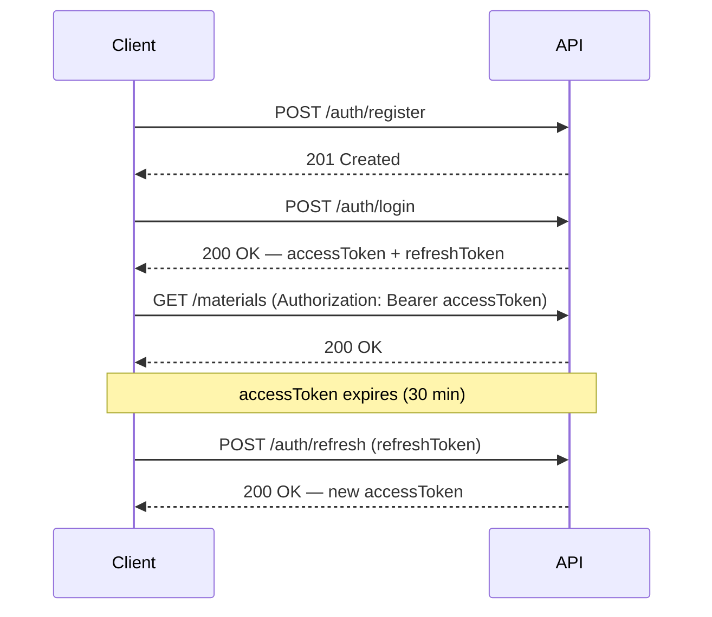

# Document 5: API Design

## Document Control

| Field | Value |
|---|---|
| Project Name | Business Market Monitoring & Alert Platform |
| Document | API Design (REST) |
| Version | 1.1 (Frozen) |
| Status | **Approved — Frozen** |
| Phase | Version 1 (MVP) |
| Baseline Reference | Document 1 (v1.2), Document 2 (v1.1), Document 3 (v1.1), Document 4 (v1.1) — all Frozen |
| Prepared By | Engineering (API Architect) |
| Date | 2026-07-18 |
| Approved By | Project Owner, 2026-07-18 |

**Revision note (1.1):** Four documentation-only refinements — added an Idempotency Considerations subsection (§1.7, no V1 implementation), added Bulk Operations to Future Extension Points (§8, no V1 endpoint), expanded `/health` to surface scheduler/sync status from `sync_statuses` (§4.11), and replaced hardcoded auth rate-limit values with environment variables (§5). No endpoint, table, or approved design decision was changed. **Document frozen and approved — no further changes without a formal revision.**

**Traceability rule:** every endpoint in this document exists because a specific requirement in Document 2 (SRS) needs it, and reads/writes a specific table from Document 4 (Database Design). Where an endpoint isn't directly traceable to an FR (System Health; the `/auth/refresh` mechanics), that's stated explicitly rather than implied. No endpoint is included for a V2/V3 feature.

**Constraint respected throughout:** Documents 1–4 are frozen. Nothing here requires a schema change — where a natural API feature (e.g., server-side refresh-token revocation) would normally want new persisted state, this document designs around the existing frozen schema instead, and names that trade-off explicitly rather than quietly assuming a table that doesn't exist.

---

## 1. API Design Principles

### 1.1 RESTful Conventions
Endpoints are **resource-nouns**, not actions — `/materials`, `/alerts/rules`, `/news` — with one deliberate, standard exception: `/auth/*` (login, register, refresh) is inherently action-oriented, which is the normal, accepted REST exception for authentication (a login isn't a resource you CRUD).

### 1.2 Stateless Architecture
No server-side session state. Every request is authenticated independently via a JWT bearer token (Document 3 §7). This is what lets the API layer scale horizontally (NFR-SC-01) — any app instance can validate any request without shared session storage.

### 1.3 Resource-Based Endpoints
Nested resources are used only where a real ownership hierarchy exists — e.g., `/materials/:materialId/prices` (a price point cannot exist without its material). Where V1 has exactly one business per user (Document 1 §9, V1 constraint), business-scoped endpoints are **not** nested under a `:businessId` — see 1.5.

### 1.4 Versioning Strategy
**Chosen: URI-based versioning** — every endpoint is prefixed `/api/v1/...`.
- **Alternative considered:** header-based versioning (e.g., an `Accept-Version` header) or query-parameter versioning (`?version=1`).
- **Trade-off:** header-based versioning is arguably more "pure" REST (a URL should represent a resource, not a version), but it's less discoverable, harder to test with a browser or a simple `curl`, and less obvious to document for a small team. URI versioning is explicit, cacheable, and simple to implement in Express (mount a `v1Router` at `/api/v1`, add a `v2Router` at `/api/v2` later without touching v1). **Recommended for V1** — full reasoning for how this scales to a real v2 is in Section 7.

### 1.5 Why Business-Scoped Endpoints Have No `:businessId`
`/api/v1/business`, `/api/v1/materials`, `/api/v1/alerts/rules` etc. are **singular and implicit** — they always refer to *the current authenticated user's* business, resolved from the JWT, never from a URL parameter. This directly reflects Document 1's V1 constraint (one business per user) and Document 4's schema (`businesses.user_id` is UNIQUE). It also closes a security surface: there's no `:businessId` in the URL to tamper with in the first place. **This is a deliberate V1 shape, not an oversight** — Section 8 explains exactly what changes here when V3 allows multiple businesses per user.

### 1.6 Naming Conventions

| Element | Convention | Example |
|---|---|---|
| URL path segments | plural nouns, `kebab-case` for multi-word | `/materials`, `/password-reset` |
| JSON body/response fields | `camelCase` | `trackedMaterialId`, `thresholdPrice` |
| Database columns (Document 4) | `snake_case` | `tracked_material_id`, `threshold_price` |
| Query parameters | `camelCase` | `?page=1&trackedOnly=true` |

**The `snake_case` ↔ `camelCase` boundary is deliberate:** the database stays in its own convention (Document 4 §2.3); the API surface uses idiomatic JSON/JavaScript casing. This translation happens once, in the Data Access/Service layer (Document 3 §3) — never leaked into either direction.

### 1.7 Idempotency Considerations *(documentation only — no V1 implementation)*

Business-critical `POST` operations — most notably `POST /materials/:materialId/prices` (manual price entry, Section 4.6) — are not idempotent in V1: a duplicate network retry from the client could create a duplicate price point, since there's no client-supplied identifier to detect a repeat. A future version may support an optional `Idempotency-Key` request header on these endpoints, where the server caches the response for a given key and returns the original result on a repeated request with the same key, rather than creating a second record. **This is noted here as a documented design consideration for a future version — it introduces no new V1 endpoint, table, or behavior**, and doesn't affect any of the 30 endpoints specified in Section 4 as they stand today.

---

## 2. Authentication Strategy

### 2.1 JWT Authentication Flow



- **Access token:** JWT, expires in **30 minutes** (`JWT_ACCESS_EXPIRY`, configurable). Payload: `{ sub: userId, businessId, email, iat, exp }`. Sent as `Authorization: Bearer <accessToken>` on every protected request.
- **Refresh token:** JWT, expires in **7 days** (`JWT_REFRESH_EXPIRY`, configurable), distinguished by a `type: "refresh"` claim, used only against `POST /auth/refresh`.

### 2.2 Why the Refresh Token Is Stateless (a frozen-schema constraint, named explicitly)

A more complete production design would persist refresh tokens server-side (enabling instant revocation on logout, and rotation-on-use). That would need a new table — but **Document 4 is frozen**, and `user_tokens` is scoped specifically to `PASSWORD_RESET`/`EMAIL_VERIFICATION` (Document 4 §5.1), not refresh tokens. Rather than quietly reaching for a schema change mid-API-design, this document designs within the existing schema: **the refresh token is a second, longer-lived, stateless JWT** — verified by signature and expiry alone, nothing looked up in the database.

**Consequence, stated plainly:** logout in V1 is client-side only (the client discards both tokens) — which is exactly what FR-AUTH-06 already specifies ("client-side token invalidation at minimum; server-side blacklisting optional for V1"). Server-side revocation (a `refresh_tokens` table with a `revoked_at` column, or a blacklist) is a real, valuable hardening step — it's listed as a Future Extension Point (Section 8), not silently accepted as a permanent gap.

### 2.3 Protected vs. Public Endpoints

| Public (no token required) | Protected (valid `Bearer` token required) |
|---|---|
| `POST /auth/register` | Everything under `/business` |
| `POST /auth/login` | Everything under `/materials` |
| `POST /auth/refresh` | Everything under `/alerts` |
| `POST /auth/password-reset/request` | `/dashboard` |
| `POST /auth/password-reset/confirm` | `/news` |
| `POST /auth/email-verification/request` *(requires a valid token first, but its own call is reachable pre-verification)* | |
| `GET /auth/email-verification/confirm` | |
| `GET /industries`, `GET /industries/:id`, `GET /industries/:id/knowledge-base` | |
| `GET /units-of-measurement` | |
| `GET /health` | |

Knowledge Base and health endpoints are public deliberately — they're non-sensitive, platform-wide reference data with no per-business content, and `GET /industries` specifically needs to be reachable before a business exists (during onboarding, immediately after login but before `POST /business`).

### 2.4 Authorization Rules

- Every protected endpoint resolves `businessId` **from the verified JWT**, never from a client-supplied URL/body parameter (Document 3 §13, NFR-SEC-03).
- Every repository call scopes its query by that `businessId` (Document 3 §3, Data Access Layer).
- **Cross-tenant access returns `404`, not `403`.** If a `materialId` in the URL exists but belongs to a different business, the API responds `404 Not Found` — not `403 Forbidden`. This deliberately avoids confirming to an unauthorized caller that the resource exists at all under someone else's account.

### 2.5 Token Expiration & Refresh Strategy

| Token | Lifetime | On expiry |
|---|---|---|
| Access token | 30 minutes | Client calls `POST /auth/refresh` with the refresh token to get a new access token, transparently, without re-prompting login |
| Refresh token | 7 days | Client must log in again (`POST /auth/login`) |

---

## 3. API Standards

### 3.1 HTTP Methods

| Method | Use | In this API |
|---|---|---|
| `GET` | Read, no side effects | Listing/fetching resources |
| `POST` | Create a new resource | Registration, creating a business, adding a material, logging a manual price, creating an alert rule |
| `PUT` | Full replacement of a resource | Business Profile update only (Section 4.2) — all editable fields must be supplied |
| `PATCH` | Partial update | Tracked Material toggling, Alert Rule editing — only the changed fields are supplied |
| `DELETE` | Remove a resource *(client-facing semantics — server behavior may be a soft delete, stated explicitly per endpoint)* | Alert Rule deletion (implemented as soft delete, Document 4 §12.2) |

### 3.2 Status Codes

Directly extends the `AppError` taxonomy already approved in Document 3 §12 — no new codes invented here:

| Status | Meaning | Error `code` (Section 6) |
|---|---|---|
| 200 | Success (read or update) | — |
| 201 | Resource created | — |
| 400 | Validation error — malformed/invalid request | `VALIDATION_ERROR` |
| 401 | Missing/invalid/expired token | `AUTHENTICATION_ERROR` |
| 403 | Valid token, action not permitted | `AUTHORIZATION_ERROR` |
| 404 | Resource not found (including cross-tenant access, §2.4) | `NOT_FOUND` |
| 409 | Conflict (e.g., duplicate email, business already exists) | `CONFLICT` |
| 500 | Unexpected server error | `INTERNAL_ERROR` |

**No `204 No Content`, by deliberate choice:** even for the Alert Rule delete endpoint, this API always returns a small JSON body matching the standard envelope (Section 3.4) rather than an empty `204` — consistency of response shape across every endpoint was judged more valuable than strict adherence to "delete returns nothing."

### 3.3 Request Validation

All request bodies and query parameters are validated by schema-validation middleware (Document 3 §13, Application Layer) **before** any controller or service code runs. A schema-validation library (e.g., Zod) is recommended at implementation time — this document specifies *what* must be validated per endpoint (Section 4), not the library itself, which is an implementation detail for Document 5's build phase.

### 3.4 Response Format (standard envelope)

**Success:**
```json
{
  "success": true,
  "data": { },
  "meta": { }
}
```
`meta` is present only where relevant (pagination — Section 3.5).

**Error** (Section 6 has the full standard):
```json
{
  "success": false,
  "error": {
    "code": "VALIDATION_ERROR",
    "message": "Human-readable summary",
    "details": []
  }
}
```

### 3.5 Pagination Convention

Applies to `GET /news`, `GET /materials/:id/prices/history`, `GET /alerts/events`:

- Query params: `?page=1&limit=20` (defaults `page=1`, `limit=20`, max `limit=100`)
- Response `meta`: `{ "page": 1, "limit": 20, "total": 143, "totalPages": 8 }`

---

## 4. Module-Wise API Design

### 4.1 Authentication Module

*Maps to Document 2 §5.1, table `users`, `user_tokens`.*

#### `POST /api/v1/auth/register`
**Purpose:** creates a new user account — the entry point to the entire platform (FR-AUTH-01).

| Auth Required | No |
|---|---|

**Request Body**
```json
{ "email": "owner@business.com", "password": "StrongPass123!", "fullName": "Asha Rao" }
```
**Success Response — 201**
```json
{ "success": true, "data": { "id": 1, "email": "owner@business.com", "fullName": "Asha Rao" } }
```
**Error Responses**

| Status | Code | Condition |
|---|---|---|
| 400 | VALIDATION_ERROR | Missing/malformed field, weak password |
| 409 | CONFLICT | Email already registered (FR-AUTH-03) |

**Validation Rules:** valid email format · password meets minimum strength policy (FR-AUTH-02) · `fullName` non-empty
**Related Tables:** `users` · **Related SRS IDs:** FR-AUTH-01, FR-AUTH-02, FR-AUTH-03

#### `POST /api/v1/auth/login`
**Purpose:** authenticates a user and issues tokens (FR-AUTH-04).

| Auth Required | No |
|---|---|

**Request Body**
```json
{ "email": "owner@business.com", "password": "StrongPass123!" }
```
**Success Response — 200**
```json
{ "success": true, "data": { "accessToken": "...", "refreshToken": "...", "expiresIn": 1800 } }
```
**Error Responses**

| Status | Code | Condition |
|---|---|---|
| 400 | VALIDATION_ERROR | Missing fields |
| 401 | AUTHENTICATION_ERROR | Invalid email or password — **same message for both cases** (FR-AUTH-05, doesn't reveal which was wrong) |

**Validation Rules:** both fields required
**Related Tables:** `users` · **Related SRS IDs:** FR-AUTH-04, FR-AUTH-05

#### `POST /api/v1/auth/refresh`
**Purpose:** exchanges a valid refresh token for a new access token, without re-prompting login (§2.1–2.2).

| Auth Required | No *(the refresh token itself is the credential)* |
|---|---|

**Request Body**
```json
{ "refreshToken": "..." }
```
**Success Response — 200**
```json
{ "success": true, "data": { "accessToken": "...", "expiresIn": 1800 } }
```
**Error Responses**

| Status | Code | Condition |
|---|---|---|
| 401 | AUTHENTICATION_ERROR | Refresh token missing, expired, invalid signature, or not of `type: "refresh"` |

**Validation Rules:** token must verify and carry `type: "refresh"`
**Related Tables:** none (stateless, §2.2) · **Related SRS IDs:** FR-AUTH-04 (session continuity)

#### `POST /api/v1/auth/logout`
**Purpose:** client-side session end (FR-AUTH-06). Since refresh tokens are stateless (§2.2), this endpoint's role is to give the client an explicit, documented call to make — the actual invalidation is the client discarding both tokens.

| Auth Required | Yes |
|---|---|

**Request Body:** none
**Success Response — 200**
```json
{ "success": true, "data": { "message": "Logged out" } }
```
**Error Responses:** 401 AUTHENTICATION_ERROR if no valid token was presented
**Validation Rules:** none beyond auth
**Related Tables:** none · **Related SRS IDs:** FR-AUTH-06

#### `POST /api/v1/auth/password-reset/request`
**Purpose:** starts the password reset flow by emailing a reset link (FR-AUTH-07, mandatory in V1 per Document 2 §5.1).

| Auth Required | No |
|---|---|

**Request Body**
```json
{ "email": "owner@business.com" }
```
**Success Response — 200** *(always, regardless of whether the email exists — prevents email enumeration)*
```json
{ "success": true, "data": { "message": "If that email is registered, a reset link has been sent." } }
```
**Error Responses:** 400 VALIDATION_ERROR for malformed email only
**Validation Rules:** valid email format
**Related Tables:** `users`, `user_tokens` (`token_type = PASSWORD_RESET`) · **Related SRS IDs:** FR-AUTH-07

#### `POST /api/v1/auth/password-reset/confirm`
**Purpose:** completes the reset using the emailed token (FR-AUTH-07).

| Auth Required | No |
|---|---|

**Request Body**
```json
{ "token": "...", "newPassword": "NewStrongPass456!" }
```
**Success Response — 200**
```json
{ "success": true, "data": { "message": "Password updated" } }
```
**Error Responses**

| Status | Code | Condition |
|---|---|---|
| 400 | VALIDATION_ERROR | Weak new password |
| 401 | AUTHENTICATION_ERROR | Token invalid, expired, or already consumed |

**Validation Rules:** token must match an unconsumed, unexpired `user_tokens` row · new password meets strength policy
**Related Tables:** `users`, `user_tokens` · **Related SRS IDs:** FR-AUTH-07

#### `POST /api/v1/auth/email-verification/request`
**Purpose:** sends a verification email (FR-AUTH-08 — **optional/non-blocking**, per Document 2 §5.1; nothing else in this API gates on its completion).

| Auth Required | Yes |
|---|---|

**Request Body:** none
**Success Response — 200**
```json
{ "success": true, "data": { "message": "Verification email sent" } }
```
**Error Responses:** 401 AUTHENTICATION_ERROR only
**Related Tables:** `user_tokens` (`token_type = EMAIL_VERIFICATION`) · **Related SRS IDs:** FR-AUTH-08

#### `GET /api/v1/auth/email-verification/confirm`
**Purpose:** completes verification via the emailed link (FR-AUTH-08).

| Auth Required | No |
|---|---|

**Request Parameters:** query `?token=...`
**Success Response — 200**
```json
{ "success": true, "data": { "message": "Email verified" } }
```
**Error Responses:** 401 AUTHENTICATION_ERROR if token invalid/expired/consumed
**Related Tables:** `users` (`email_verified_at`), `user_tokens` · **Related SRS IDs:** FR-AUTH-08

> **Note — no `GET /auth/me` endpoint.** Deliberately omitted: no SRS requirement calls for a distinct "current user profile" view separate from the Business Profile, and the minimal identity the frontend needs (`userId`, `email`, `businessId`) is already available client-side in the decoded JWT payload. Adding an endpoint with no corresponding feature was avoided per your instruction, even though it's a common pattern in other APIs.

---

### 4.2 Business Profile Module

*Maps to Document 2 §5.2, table `businesses`.*

#### `POST /api/v1/business`
**Purpose:** creates the user's one V1 business profile (FR-BIZ-01, 02, 04). **This is also where Industry Template generation happens** (FR-TPL-01) — see the note below; there is no separate endpoint for it (Section 4.4).

| Auth Required | Yes |
|---|---|

**Request Body**
```json
{ "name": "Aqua Pure Bottling Co.", "industryId": 1, "contactEmail": "ops@aquapure.com", "contactPhone": "+91...", "address": "..." }
```
**Success Response — 201**
```json
{ "success": true, "data": { "id": 1, "name": "Aqua Pure Bottling Co.", "industryId": 1, "materialsGenerated": 5 } }
```
`materialsGenerated` confirms the Template step ran (FR-TPL-03: no manual entry needed beyond industry selection).

**Error Responses**

| Status | Code | Condition |
|---|---|---|
| 400 | VALIDATION_ERROR | Missing name/industryId, invalid industryId |
| 409 | CONFLICT | This user already has a business (V1's 1:1 rule, Document 4 §5.2) |

**Validation Rules:** `name` required · `industryId` must reference an existing `industries` row (FR-BIZ-02)
**Related Tables:** `businesses`, `tracked_materials` (created as a side effect) · **Related SRS IDs:** FR-BIZ-01, FR-BIZ-02, FR-BIZ-04, FR-TPL-01, FR-TPL-03

#### `GET /api/v1/business`
**Purpose:** retrieves the current user's business profile — needed by essentially every screen in the app to know onboarding is complete.

| Auth Required | Yes |
|---|---|

**Success Response — 200**
```json
{ "success": true, "data": { "id": 1, "name": "Aqua Pure Bottling Co.", "industryId": 1, "industryName": "Packaged Drinking Water", "contactEmail": "...", "newsDigestEnabled": true, "newsDigestFrequency": "WEEKLY" } }
```
**Error Responses:** 404 NOT_FOUND if the user hasn't completed `POST /business` yet
**Related Tables:** `businesses`, `industries` (joined for `industryName`) · **Related SRS IDs:** FR-BIZ-01

#### `PUT /api/v1/business`
**Purpose:** edits the business profile (FR-BIZ-03) — full replacement of editable fields.

| Auth Required | Yes |
|---|---|

**Request Body**
```json
{ "name": "...", "contactEmail": "...", "contactPhone": "...", "address": "...", "newsDigestEnabled": true, "newsDigestFrequency": "WEEKLY" }
```
**Success Response — 200:** updated business object (same shape as `GET`)
**Error Responses:** 400 VALIDATION_ERROR (bad `newsDigestFrequency` enum value, etc.) · 404 NOT_FOUND

**Validation Rules:** `name` required · `newsDigestFrequency` must be one of `DAILY`/`WEEKLY`/`MONTHLY`
> **Deliberately not editable here: `industryId`.** Changing industry after materials, prices, and alerts already exist tied to the original industry's Knowledge Base would orphan/mismatch that data — supporting an industry change would need its own re-templating workflow, out of V1 scope. If a business genuinely changes industry in V1, the answer is a new account. This is a stated MVP limitation, not an oversight.

**Related Tables:** `businesses` · **Related SRS IDs:** FR-BIZ-03

---

### 4.3 Industry Knowledge Base Module

*Maps to Document 2 §5.3, tables `industries`, `raw_materials`, `cost_drivers`, `external_factors`, `news_keywords`, `knowledge_base_dependencies`, `units_of_measurement`. **Read-only** — per OI-1 (Document 2), the Knowledge Base is maintained via seed data/scripts, with no write endpoints in V1.*

#### `GET /api/v1/industries`
**Purpose:** lists the 5 approved industries — powers the onboarding industry-selection step (FR-BIZ-02) and is reachable before a business exists.

| Auth Required | No (public, §2.3) |
|---|---|

**Success Response — 200**
```json
{ "success": true, "data": [ { "id": 1, "name": "Packaged Drinking Water", "slug": "packaged-drinking-water", "isAnchor": true, "isLightweightTemplate": false } ] }
```
**Related Tables:** `industries` · **Related SRS IDs:** FR-IKB-01

#### `GET /api/v1/industries/:industryId`
**Purpose:** single industry detail (name, description) — supports a UI that shows industry info before selection.

| Auth Required | No |
|---|---|

**Error Responses:** 404 NOT_FOUND if `industryId` doesn't exist
**Related Tables:** `industries` · **Related SRS IDs:** FR-IKB-01

#### `GET /api/v1/industries/:industryId/knowledge-base`
**Purpose:** returns the full Knowledge Base entry for one industry — raw materials, cost drivers, external factors, news keywords, and dependencies (FR-IKB-01, FR-IKB-02, FR-IKB-05). This is what `TemplateGenerationService` (Document 3 §11) reads internally, and what a "why is this material here" info panel in the UI would call directly.

| Auth Required | No |
|---|---|

**Success Response — 200**
```json
{
  "success": true,
  "data": {
    "industryId": 1,
    "rawMaterials": [ { "id": 10, "name": "PET Resin", "defaultUnit": "kg" } ],
    "costDrivers": [ { "id": 20, "name": "Electricity" } ],
    "externalFactors": [ { "id": 30, "name": "Crude Oil Prices" } ],
    "newsKeywords": [ { "id": 40, "keyword": "PET resin price" } ],
    "dependencies": [ { "sourceType": "RAW_MATERIAL", "sourceId": 10, "targetType": "EXTERNAL_FACTOR", "targetId": 30, "dependencyType": "DRIVES_COST" } ]
  }
}
```
**Error Responses:** 404 NOT_FOUND if `industryId` doesn't exist
**Related Tables:** all 6 Knowledge Base tables (Document 4 §5.3) · **Related SRS IDs:** FR-IKB-01, FR-IKB-02, FR-IKB-05

#### `GET /api/v1/units-of-measurement`
**Purpose:** lists all standard units — populates the unit dropdown when a business adds a custom material (FR-MAT-02, FR-MAT-04).

| Auth Required | No |
|---|---|

**Success Response — 200**
```json
{ "success": true, "data": [ { "id": 1, "name": "Kilogram", "abbreviation": "kg" } ] }
```
**Related Tables:** `units_of_measurement` · **Related SRS IDs:** FR-MAT-04

---

### 4.4 Industry Templates Module

*Maps to Document 2 §5.4. **No dedicated endpoints exist for this module.***

This isn't an omission — it directly follows Document 4's schema decision (§5.4): there is no separate `templates` table, because a Template is simply the initial state of `tracked_materials` right after `POST /business` runs (FR-TPL-01 is satisfied as a side effect, Section 4.2). Reviewing the generated template (FR-TPL-02) is the same operation as listing tracked materials — `GET /api/v1/materials` (Section 4.5). Building separate `/templates/*` endpoints that return the same underlying data as `/materials` would duplicate surface area for no functional gain, which the project's stated principles explicitly ask to avoid ("avoid unnecessary complexity" / "avoid unnecessary tables").

---

### 4.5 Raw Material Tracking Module

*Maps to Document 2 §5.5, table `tracked_materials`.*

#### `GET /api/v1/materials`
**Purpose:** lists the business's materials — both the KB-generated template and any custom additions (FR-MAT-01, 02) — and doubles as the Template review screen (FR-TPL-02, Section 4.4).

| Auth Required | Yes |
|---|---|

**Request Parameters:** query `?trackedOnly=true` *(optional — default `false`, returns everything including untracked template items so the user can toggle them on)*
**Success Response — 200**
```json
{ "success": true, "data": [ { "id": 100, "rawMaterialId": 10, "name": "PET Resin", "unit": "kg", "isTracked": true, "isCustom": false } ] }
```
**Related Tables:** `tracked_materials`, `raw_materials` (joined for name/unit where KB-linked) · **Related SRS IDs:** FR-MAT-01, FR-MAT-02, FR-MAT-03, FR-TPL-02

#### `POST /api/v1/materials`
**Purpose:** adds a material not present in the industry's Knowledge Base (FR-MAT-02).

| Auth Required | Yes |
|---|---|

**Request Body**
```json
{ "customName": "Recycled PET Flakes", "unitId": 1 }
```
**Success Response — 201:** created material object (same shape as list item, `isCustom: true`)
**Error Responses:** 400 VALIDATION_ERROR (missing `customName`/`unitId`, invalid `unitId`)
**Validation Rules:** `customName` non-empty · `unitId` must reference an existing `units_of_measurement` row
**Related Tables:** `tracked_materials` · **Related SRS IDs:** FR-MAT-02, FR-MAT-04

#### `PATCH /api/v1/materials/:materialId`
**Purpose:** toggles tracking on/off (FR-MAT-01, FR-MAT-03) or edits a custom material's name/unit.

| Auth Required | Yes |
|---|---|

**Request Body** *(any subset)*
```json
{ "isTracked": false }
```
**Success Response — 200:** updated material object
**Error Responses**

| Status | Code | Condition |
|---|---|---|
| 400 | VALIDATION_ERROR | Attempting to change `customName`/`unitId` on a KB-linked material (`rawMaterialId` not null) |
| 404 | NOT_FOUND | `materialId` doesn't exist or belongs to another business (§2.4) |

**Validation Rules:** `customName`/`unitId` changes only permitted when `rawMaterialId IS NULL` (matches Document 4 §10.4's CHECK constraint intent)
> **No `DELETE` endpoint for materials, deliberately.** FR-MAT-03 explicitly requires that stopping tracking must *not* delete historical price data — that's exactly what `isTracked: false` does. A true delete would conflict with `price_points`' `ON DELETE RESTRICT` (Document 4 §10.1) by design.

**Related Tables:** `tracked_materials` · **Related SRS IDs:** FR-MAT-01, FR-MAT-03

---

### 4.6 Price Tracking Module

*Maps to Document 2 §5.6, table `price_points`. Covers the **write path** (manual entry) and the **latest-value read**; range/comparison reads are in Historical Trends (Section 4.10) — both hit the same table, split by SRS module and distinct query pattern (Document 4 §9).*

#### `GET /api/v1/materials/:materialId/prices/latest`
**Purpose:** the current price shown on the Dashboard for a material (FR-PRICE-04).

| Auth Required | Yes |
|---|---|

**Success Response — 200**
```json
{ "success": true, "data": { "price": "142.50", "recordedAt": "2026-07-15T00:00:00Z", "source": "MANUAL" } }
```
**Error Responses:** 404 NOT_FOUND if `materialId` doesn't exist for this business, **or** exists but has no price points yet
**Related Tables:** `price_points` (query uses the `(tracked_material_id, recorded_at DESC)` index, Document 4 §9) · **Related SRS IDs:** FR-PRICE-04

#### `POST /api/v1/materials/:materialId/prices`
**Purpose:** manual price entry (FR-PRICE-01) — the V1 default source for materials with no free public dataset (Document 3 ADR), e.g. PET Resin.

| Auth Required | Yes |
|---|---|

**Request Body**
```json
{ "price": "142.50", "recordedAt": "2026-07-15" }
```
**Success Response — 201**
```json
{ "success": true, "data": { "id": 5001, "price": "142.50", "recordedAt": "2026-07-15T00:00:00Z", "source": "MANUAL" } }
```
**Error Responses**

| Status | Code | Condition |
|---|---|---|
| 400 | VALIDATION_ERROR | `price` ≤ 0, `recordedAt` in the future, missing fields |
| 404 | NOT_FOUND | `materialId` doesn't exist for this business, or is not currently tracked |

**Validation Rules:** `price > 0` (matches Document 4 §10.4 CHECK constraint) · `recordedAt` not in the future · material must have `isTracked = true`
> **Government-dataset-sourced prices are never written through this endpoint.** They're inserted directly by the internal, scheduled `PriceIngestionService` (Document 3 §8) — there is no public "trigger ingestion" endpoint, by design; automated sources aren't a user-facing action.

**Related Tables:** `price_points` · **Related SRS IDs:** FR-PRICE-01, FR-PRICE-02, FR-PRICE-05

---

### 4.7 Market News Module

*Maps to Document 2 §5.7, tables `news_items`, `news_item_tags`. **Read-only** — ingestion is the internal scheduled `NewsIngestionService` (Document 3 §9), not a public endpoint.*

#### `GET /api/v1/news`
**Purpose:** the news feed relevant to the business's industry (FR-NEWS-03), tagged during ingestion using the industry's Knowledge Base keywords (FR-NEWS-02, FR-NEWS-05).

| Auth Required | Yes |
|---|---|

**Request Parameters:** query `?page=1&limit=20`
**Success Response — 200**
```json
{ "success": true, "data": [ { "id": 900, "title": "Crude oil prices climb amid...", "url": "https://...", "sourceName": "Reuters", "publishedAt": "2026-07-17T00:00:00Z" } ], "meta": { "page": 1, "limit": 20, "total": 34, "totalPages": 2 } }
```
**Related Tables:** `news_items`, `news_item_tags` (joined on the business's `industryId`) · **Related SRS IDs:** FR-NEWS-02, FR-NEWS-03

---

### 4.8 Email Alerts Module

*Maps to Document 2 §5.8, tables `alert_rules`, `alert_events`. (News digest settings live on `businesses` — Section 4.2 — not here, since they're two columns on an existing resource, not a distinct one.)*

#### `GET /api/v1/alerts/rules`
**Purpose:** lists the business's alert rules (FR-ALERT-05), excluding soft-deleted ones.

| Auth Required | Yes |
|---|---|

**Success Response — 200**
```json
{ "success": true, "data": [ { "id": 200, "trackedMaterialId": 100, "conditionType": "PRICE_ABOVE", "thresholdPrice": "150.00", "isActive": true } ] }
```
**Related Tables:** `alert_rules` (`WHERE deleted_at IS NULL`) · **Related SRS IDs:** FR-ALERT-05

#### `POST /api/v1/alerts/rules`
**Purpose:** defines a new price threshold alert (FR-ALERT-01).

| Auth Required | Yes |
|---|---|

**Request Body**
```json
{ "trackedMaterialId": 100, "conditionType": "PRICE_ABOVE", "thresholdPrice": "150.00" }
```
**Success Response — 201:** created rule object
**Error Responses**

| Status | Code | Condition |
|---|---|---|
| 400 | VALIDATION_ERROR | `thresholdPrice` ≤ 0, invalid `conditionType`, missing fields |
| 404 | NOT_FOUND | `trackedMaterialId` doesn't belong to this business |

**Validation Rules:** `thresholdPrice > 0` (Document 4 §10.4) · `conditionType` ∈ `{PRICE_ABOVE, PRICE_BELOW}`
**Related Tables:** `alert_rules` · **Related SRS IDs:** FR-ALERT-01

#### `PATCH /api/v1/alerts/rules/:ruleId`
**Purpose:** enables/disables a rule or edits its threshold (FR-ALERT-05).

| Auth Required | Yes |
|---|---|

**Request Body** *(any subset)*
```json
{ "isActive": false }
```
**Success Response — 200:** updated rule object
**Error Responses:** 400 VALIDATION_ERROR · 404 NOT_FOUND (including soft-deleted rules — they behave as gone)
**Related Tables:** `alert_rules` · **Related SRS IDs:** FR-ALERT-05

#### `DELETE /api/v1/alerts/rules/:ruleId`
**Purpose:** removes a rule from the user's active list (FR-ALERT-05) — **implemented as a soft delete** (Document 4 §12.2: hard deletion is intentionally unsupported, to keep `alert_events` history intact via `ON DELETE RESTRICT`).

| Auth Required | Yes |
|---|---|

**Success Response — 200**
```json
{ "success": true, "data": { "id": 200, "deletedAt": "2026-07-18T10:00:00Z" } }
```
*(200 with a body, not 204 — consistency with the standard envelope, §3.2.)*
**Error Responses:** 404 NOT_FOUND
**Validation Rules:** none beyond ownership
**Related Tables:** `alert_rules` (`deleted_at` set, row otherwise untouched) · **Related SRS IDs:** FR-ALERT-05

#### `GET /api/v1/alerts/events`
**Purpose:** the alert history — every notification ever sent, including for rules since disabled or deleted (FR-ALERT-08).

| Auth Required | Yes |
|---|---|

**Request Parameters:** query `?page=1&limit=20`
**Success Response — 200**
```json
{ "success": true, "data": [ { "id": 5, "triggeredPrice": "151.20", "thresholdPriceSnapshot": "150.00", "conditionTypeSnapshot": "PRICE_ABOVE", "notificationChannel": "EMAIL", "deliveryStatus": "SENT", "triggeredAt": "2026-07-16T06:00:00Z" } ], "meta": { "page": 1, "limit": 20, "total": 12, "totalPages": 1 } }
```
**Related Tables:** `alert_events` (query uses the `(business_id, triggered_at DESC)` index, Document 4 §9) · **Related SRS IDs:** FR-ALERT-08

---

### 4.9 Dashboard Module

*Maps to Document 2 §5.9. Composes reads across `tracked_materials`, `price_points`, `news_items`, `alert_rules`, `alert_events`, `sync_statuses` — no table of its own.*

#### `GET /api/v1/dashboard`
**Purpose:** the single aggregated read for the app's primary screen (FR-DASH-01–04). One endpoint, not four separate calls, specifically to meet NFR-PERF-01 (dashboard load under 2 seconds) — matches `DashboardAggregationService` (Document 3 §5).

| Auth Required | Yes |
|---|---|

**Success Response — 200**
```json
{
  "success": true,
  "data": {
    "trackedMaterials": [ { "id": 100, "name": "PET Resin", "latestPrice": "142.50", "significantChange": false } ],
    "recentNews": [ { "id": 900, "title": "..." } ],
    "activeAlertRules": [ { "id": 200, "conditionType": "PRICE_ABOVE", "thresholdPrice": "150.00" } ],
    "recentAlertEvents": [ { "id": 5, "triggeredAt": "2026-07-16T06:00:00Z" } ],
    "sync": { "lastPriceSyncAt": "2026-07-18T05:00:00Z", "lastNewsSyncAt": "2026-07-18T05:00:00Z" }
  }
}
```
**Error Responses:** 404 NOT_FOUND if the business hasn't been created yet
**Validation Rules:** `significantChange` uses a configurable percentage threshold (FR-DASH-02) — not user-input, a server-side computed flag
**Related Tables:** `tracked_materials`, `price_points`, `news_items`, `news_item_tags`, `alert_rules`, `alert_events`, `sync_statuses` · **Related SRS IDs:** FR-DASH-01, FR-DASH-02, FR-DASH-03, FR-DASH-04

---

### 4.10 Historical Trends Module

*Maps to Document 2 §5.10, table `price_points` — the range/comparison read path (distinct from Section 4.6's latest-value/write path).*

#### `GET /api/v1/materials/:materialId/prices/history`
**Purpose:** the trend chart data for one material (FR-HIST-01, FR-HIST-02).

| Auth Required | Yes |
|---|---|

**Request Parameters:** query `?from=2026-01-01&to=2026-07-18&page=1&limit=100`
**Success Response — 200**
```json
{ "success": true, "data": [ { "price": "138.00", "recordedAt": "2026-01-05T00:00:00Z" } ], "meta": { "page": 1, "limit": 100, "total": 42, "totalPages": 1 } }
```
Ordered chronologically (`recordedAt ASC`) — chart-ready without client-side re-sorting.
**Error Responses:** 400 VALIDATION_ERROR (`from` after `to`) · 404 NOT_FOUND
**Related Tables:** `price_points` · **Related SRS IDs:** FR-HIST-01, FR-HIST-02

#### `GET /api/v1/materials/prices/compare`
**Purpose:** overlays multiple materials' trends on one chart (FR-HIST-03).

| Auth Required | Yes |
|---|---|

**Request Parameters:** query `?materialIds=100,101,102&from=&to=`
**Success Response — 200**
```json
{ "success": true, "data": [ { "materialId": 100, "name": "PET Resin", "series": [ { "price": "138.00", "recordedAt": "2026-01-05T00:00:00Z" } ] } ] }
```
**Error Responses:** 400 VALIDATION_ERROR (more than 5 `materialIds` — a practical operational limit, not an SRS requirement, stated as such) · 404 NOT_FOUND if any listed material doesn't belong to this business
**Validation Rules:** 1–5 `materialIds`, all must belong to the requesting business
**Related Tables:** `price_points` · **Related SRS IDs:** FR-HIST-03

---

### 4.11 System Health Module

*Not mapped to a specific FR — an operational/infrastructure module, explicitly requested as its own module. Supports NFR-REL-01/02 and Render deployment health checks (Document 3 §15).*

#### `GET /api/v1/health`
**Purpose:** liveness/readiness check for hosting-platform monitoring (Render) and manual diagnostics — confirms the app process is up, the database is reachable, and (expanded per review) surfaces the scheduler's last-known state so an operator can tell ingestion is actually running, not just that the API is up.

| Auth Required | No |
|---|---|

**Success Response — 200**
```json
{
  "success": true,
  "data": {
    "status": "ok",
    "database": "connected",
    "timestamp": "2026-07-18T10:00:00Z",
    "scheduler": {
      "priceIngestion": { "lastRunAt": "2026-07-18T05:00:00Z", "lastSuccessAt": "2026-07-18T05:00:00Z", "lastStatus": "SUCCESS" },
      "newsIngestion": { "lastRunAt": "2026-07-18T05:00:00Z", "lastSuccessAt": "2026-07-18T05:00:00Z", "lastStatus": "SUCCESS" }
    }
  }
}
```
The `scheduler` block is read directly from `sync_statuses` (Document 4 §5.7) — the same table `GET /dashboard` reads for its user-facing `sync` field (Section 4.9); here it's exposed for operational diagnostics rather than end-user display. If a job has never run yet, its `lastRunAt`/`lastSuccessAt`/`lastStatus` are returned as `null` rather than omitted, so the shape stays predictable for monitoring tools.

**Error Responses:** 500 INTERNAL_ERROR (with `"database": "unreachable"` in the body) if the DB connection check fails
**Related Tables:** `sync_statuses` (scheduler block); otherwise a lightweight `SELECT 1`–style check, not a business query · **Related SRS IDs:** none — supports NFR-REL-01, NFR-REL-02, FR-DASH-04 (shares its data source)

---

## 5. API Security

Directly implements Document 3 §13 at the API layer — no new security decisions are introduced here, only their concrete expression as middleware/behavior:

| Control | API-layer implementation |
|---|---|
| JWT validation | Middleware verifies signature + expiry on every protected route (§2.3 table); rejects with 401 before any controller runs |
| Authorization checks | `businessId` always from the verified JWT, never from the URL/body (§2.4); cross-tenant access returns 404, not 403 |
| Input validation | Schema-validation middleware per endpoint (§3.3), applied before controllers |
| SQL injection prevention | Parameterized queries only, enforced at the Data Access Layer (Document 3 §13) — the API layer never constructs raw SQL |
| Rate limiting | Applied specifically to `/auth/login`, `/auth/register`, `/auth/password-reset/*` — window and threshold are **configurable via environment variables** (`AUTH_RATE_LIMIT_WINDOW`, `AUTH_RATE_LIMIT_MAX_REQUESTS`) rather than hardcoded, so deployment environments (dev/staging/production) can adjust limits without a code change. Recommended production defaults: `AUTH_RATE_LIMIT_WINDOW=15m`, `AUTH_RATE_LIMIT_MAX_REQUESTS=10` — using standard Express rate-limiting middleware (Document 3 §13) |
| CORS policy | Restricted to the deployed frontend origin(s) via environment variable — no wildcard `*` in production |

---

## 6. API Error Handling

Every error response uses the same envelope (§3.4), with `code` values drawn from a fixed set matching Document 3's `AppError` hierarchy:

| `code` | Status | Meaning |
|---|---|---|
| `VALIDATION_ERROR` | 400 | Request body/params failed validation |
| `AUTHENTICATION_ERROR` | 401 | Missing, invalid, or expired token/credentials |
| `AUTHORIZATION_ERROR` | 403 | Authenticated but not permitted *(reserved — V1's design mostly resolves this as 404 instead, §2.4; kept in the taxonomy for cases that genuinely are "you may not," not "this isn't yours")* |
| `NOT_FOUND` | 404 | Resource doesn't exist, or belongs to another business |
| `CONFLICT` | 409 | Duplicate resource (email, existing business) |
| `INTERNAL_ERROR` | 500 | Unexpected failure — client sees only a generic message; full detail is server-side logged only (Document 3 §12), never in the response |

**Example — validation error:**
```json
{
  "success": false,
  "error": {
    "code": "VALIDATION_ERROR",
    "message": "Request validation failed",
    "details": [ { "field": "thresholdPrice", "issue": "must be greater than 0" } ]
  }
}
```

**Example — not found:**
```json
{
  "success": false,
  "error": { "code": "NOT_FOUND", "message": "Material not found" }
}
```

---

## 7. API Versioning Strategy

- **All V1 endpoints live under `/api/v1/`.** A future `/api/v2/` would be mounted as an entirely separate Express router, alongside — not replacing — `v1Router`, so existing (v1) clients keep working unmodified during any transition period.
- **Backward compatibility rule for v1 itself:** once released, a v1 response shape is never changed in a breaking way (removing a field, changing a field's type, changing status-code semantics). **Only additive changes** (new optional fields, new endpoints) are made under the existing `/api/v1/` prefix.
- **This means most V2 features don't need a version bump at all** — e.g., adding an `impact-analysis` endpoint, or an optional `channel` field to alert rule creation, are additive and can ship under `/api/v1/` as-is. A full `/api/v2/` is reserved for genuine breaking changes.
- **The one V1 design choice that's a known future breaking point:** Section 1.5's implicit (no `:businessId`) URL shape. Multi-business support (V3) is the one change that doesn't have a clean additive path — see Section 8.

---

## 8. Future Extension Points

Identified for context; **none of this is implemented in V1**:

| V2/V3 Feature | API integration point | Breaking change? |
|---|---|---|
| AI Impact Analysis (V2) | New endpoint, e.g. `GET /api/v1/materials/:materialId/impact-analysis`, reading `knowledge_base_dependencies` (Document 4 §7.3) | No — purely additive |
| WhatsApp Alerts (V2) | `POST /alerts/rules` gains an optional `channel` field (default `EMAIL`); `alert_events.notificationChannel` already supports new values at the DB layer (Document 4 §11) | No — additive, optional field |
| Supplier Integrations (V2/V3) | New `/api/v1/suppliers` resource; `price_points.source` already has room for `SUPPLIER_INTEGRATION` (Document 4 §11) | No — additive |
| Multi-Business per User (V3) | Requires resolving Section 1.5's implicit-business URL shape — either a genuine `/api/v2/` bump, or an additive compatibility path (`/api/v1/business` keeps meaning "primary business," while `/api/v1/businesses/:id` is added for explicit access) | **Yes, potentially** — the one honestly-flagged exception, consistent with Document 4 §11 already calling Enterprise/multi-tenancy the biggest lift of the four V2/V3 extensions |
| Enterprise multi-user access (V3) | New role/permission claims in the JWT payload; new endpoints for team management | No — additive to the token shape, new endpoints |
| Bulk Operations (V2+) | A future endpoint such as `POST /api/v1/materials/prices/bulk`, for importing multiple price records in one request (e.g., a CSV-driven catch-up import) — more efficient than repeated single-record `POST` calls at scale | No — additive; **not implemented in V1**, no bulk endpoint exists in Section 4 |

---

## Approval — Frozen

**Status: Approved and frozen (v1.1) by the Project Owner on 2026-07-18.** All 30 endpoints across the 11 modules are approved, along with every design decision reached during review: the stateless refresh-token design (§2.2), no `GET /auth/me`, no separate `/templates` endpoints, implicit business resolution from JWT (§1.5), 404-not-403 for cross-tenant access (§2.4), soft-delete semantics for alert rules (§4.8), and the four v1.1 documentation refinements (Idempotency Considerations, Bulk Operations extension point, expanded `/health`, configurable rate limits).

This document is now, alongside Documents 1–4, a baseline reference for all subsequent milestones. Any future change must follow the project's change management process (a formal revision with a new version number and revision note) and must not modify the approved Version 1 scope.

**Next milestone: implementation planning** (pending your explicit approval to begin).
